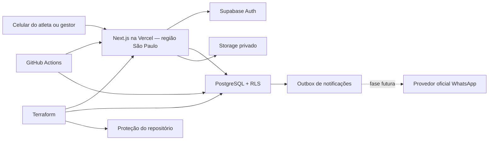

# Arquitetura

## Objetivo

O DeuTime é um SaaS multi-time. A mesma pessoa pode administrar vários times, cada time tem sua página pública por slug e nenhum dado privado pode atravessar a fronteira entre times.

## Contextos do produto

1. **Identidade e acesso** — Supabase Auth identifica a pessoa. Administradores usam e-mail e atletas usam OTP no WhatsApp sem senha. `team_memberships` define papéis administrativos; `player_profiles` e `player_position_preferences` pertencem à pessoa, independentemente de time.
   `team_invitations` representa acesso administrativo pendente.
2. **BID do time** — `athletes` é o vínculo entre perfil e time. Cada vínculo nasce pendente e exige aprovação independente do staff; `athlete_private` isola telefone, e-mail, nascimento e observações; `athlete_position_preferences` materializa as posições usadas pelo time. Antes da reivindicação por WhatsApp, owner/admin pode corrigir a identidade provisória; depois dela, nome, foto, privacidade e posições pertencem exclusivamente ao atleta. A vitrine pública inclui somente vínculos ativos cujo atleta consentiu em tornar o perfil público.
3. **Agenda** — `event_series` descreve uma recorrência e `events` materializa cada ocorrência. Jogos avulsos não precisam de série.
4. **Presença** — `event_attendance` registra a resposta do atleta para uma ocorrência específica.
5. **Divisão e escalação** — `event_squads` representa os times planejados de um evento; `lineup_spots` posiciona atletas confirmados, sem transformar RSVP ou escalação em participação real.
6. **Súmula e estatísticas** — o modelo legado mantém uma `match_report` por evento. Conforme [`DEC-EVENT-MATCH`](decisions/DEC-EVENT-MATCH.md), a expansão R04 preserva o evento como contêiner de zero a muitas partidas, cada uma com dois lados, participação real própria e fatos esportivos append-only. Estatísticas derivam somente de partidas encerradas, sem contador paralelo.
7. **Campeonatos** — conforme [`DEC-CHAMPIONSHIP-MODEL`](decisions/DEC-CHAMPIONSHIP-MODEL.md), campeonato, participantes, confrontos e slots pertencem a um único `team_id`; o vínculo opcional 1:1 fica no confronto novo e referencia `event_matches` sem alterar a partida. A flag `championships` nasce desligada e as tabelas não são públicas. Em pontos corridos, a grade de turno único é gerada e publicada sob lock por RPCs idempotentes; a classificação não possui contador próprio e é reconstruída em cada leitura a partir dos fatos de partidas finalizadas.
8. **Conversa da súmula** — conforme [`DEC-CONVERSATION-LIFETIME`](decisions/DEC-CONVERSATION-LIFETIME.md), comentários privados pertencem à partida, exigem identidade verificada e audiência congelada SIM/TALVEZ ou staff ativo; escrita fecha em sete dias e não cria chat geral.
9. **Comunicação** — `communication_consents` registra opt-in/opt-out e evidência; `notification_outbox` desacopla eventos do domínio do futuro provedor de WhatsApp.
10. **Auditoria** — `audit_logs` registra mudanças sensíveis de estado sem armazenar o conteúdo completo da PII.

## Componentes

O navegador usa apenas a chave publicável. Operações comuns são autorizadas no PostgreSQL por RLS. A chave secreta que ignora RLS existe somente no servidor; hoje ela serve à prévia mínima de convite por RPC e à assinatura de caminhos de mídia previamente filtrados por projeções públicas. O cadastro do atleta termina em sessão autenticada após OTP e chama uma RPC restrita ao próprio usuário, sem a chave secreta. Todo novo uso privilegiado exige função estreita, entrada revalidada e teste contra assinatura ou leitura arbitrária.

## Design system e experiência mobile

- Tailwind concentra os tokens semânticos de cor, raio, sombra, foco e movimento; Radix permanece restrito aos controles que precisam de comportamento acessível.
- `components/ui` fornece as primitivas de ação, campo, superfície, cabeçalho, métrica e contêiner usadas pelos fluxos públicos, administrativos e do atleta.
- controles interativos têm alvo mínimo de 44 px, estados de foco visíveis, feedback de toque e respeito a `prefers-reduced-motion`;
- no celular, as áreas autenticadas usam navegação inferior flutuante e priorizam a próxima ação; no desktop, a mesma arquitetura vira navegação horizontal;
- verde indica ação ou sucesso, enquanto a hierarquia principal usa superfícies neutras e alto contraste para não confundir marca com estado.

## Tenancy e papéis

- `owner`: controle total do time; o último owner não pode ser removido.
- `admin`: administra time, elenco e permissões operacionais.
- `manager`: administra elenco, agenda e escalações.
- atleta não é papel administrativo: é um `player_profile` ligado a um ou mais registros em `athletes`, com acesso ao time somente quando o vínculo está ativo.

Todas as tabelas de domínio carregam `team_id` ou dependem de uma chave composta que o garante. As políticas RLS consultam associação ativa ou vínculo do atleta. PII só é visível ao próprio atleta e à equipe administrativa autorizada.

## Rotas

- `/`: apresentação do produto;
- `/t/{slug}`: vitrine social do time com capa, sobre, redes, agenda, galeria e BID exclusivamente opt-in;
- `/t/{slug}/cadastro`: entrada assistida que oferece login por WhatsApp para reutilizar um perfil existente ou criação do primeiro perfil; o vínculo com o time sempre nasce como `pending`;
- `/me`: portal privado do atleta, times, jogos, presença e edição do perfil;
- `/me/agenda/{eventId}`: placar e cronologia da partida para atleta aprovado, com atualização automática durante o jogo;
- `/p/{handle}`: perfil público somente quando o próprio atleta optou por publicá-lo;
- `/auth/login`, `/auth/sign-up`, `/auth/forgot-password`, `/auth/update-password`: identidade;
- `/invite/{token}`: prévia pública mínima de convite; o aceite exige sessão e e-mail verificado;
- `/app`: roteador entre convites pendentes, criação de time e contexto existente;
- `/app/new-team`: criação guiada do time;
- `/app/{teamSlug}`: painel do time.
- `/app/{teamSlug}` prioriza o próximo jogo, a missão de ativação enquanto incompleta e uma linha do tempo derivada de eventos e movimentações do BID;
- `/app/{teamSlug}/settings`: identidade do time, visibilidade pública e convites administrativos, limitada a owner/admin;
- `/app/{teamSlug}/athletes`: BID, aprovação e disponibilidade do elenco;
- `/app/{teamSlug}/athletes/new`: cadastro administrativo atômico;
- `/app/{teamSlug}/athletes/{athleteId}/edit`: edição condicionada à propriedade do perfil, limitada a owner/admin;
- `/app/{teamSlug}/events`: agenda e contagem da chamada;
- `/app/{teamSlug}/events/new`: evento avulso ou série semanal;
- `/app/{teamSlug}/events/{eventId}`: detalhe, presença administrativa e base confirmada da escala.
- `/app/{teamSlug}/events/{eventId}/match`: súmula mobile administrativa da ocorrência.

## Convites administrativos

- o token aleatório tem 256 bits e apenas seu SHA-256 é persistido;
- a prévia por token revela somente time, papel e validade; não concede acesso;
- descoberta e aceite são vinculados ao e-mail confirmado em `auth.users`;
- aceite/recusa usa bloqueio de linha e transação única para impedir replay e corrida;
- owner pode convidar admin ou manager; admin pode convidar somente manager;
- nenhuma associação ativa é criada antes da confirmação explícita do destinatário.

A criação de times também é uma RPC estreita: exige e-mail confirmado, serializa
requisições concorrentes por usuário e aplica limites de frequência e propriedade.
O papel `authenticated` não possui `INSERT` direto em `teams`.

## Escritas operacionais

As Server Actions validam formato e tamanho, mas a autorização e a atomicidade são impostas novamente no PostgreSQL. RPCs estreitas criam atleta + PII + preferências + chamadas futuras e evento/série + local + chamadas do elenco em uma única transação. A súmula também usa RPCs estreitas: somente staff registra ou corrige lances e cada alteração gera auditoria. No modelo R04, autoria interna exige participação real na mesma partida e no mesmo lado; correção após encerramento referencia o fato anterior e exige motivo. A súmula pode ser preparada antes do horário marcado; apenas seu encerramento exige que a partida tenha começado. O papel autenticado não possui `INSERT` direto nas tabelas centrais desses agregados.

Edição e remoção do BID também passam por RPCs estreitas. Um vínculo sem histórico esportivo pode ser apagado fisicamente; havendo presença respondida, escala ou lance histórico, o registro é minimizado e arquivado. O processo remove contato, nascimento, consentimentos, posições e chamadas futuras, desconecta o usuário e preserva somente nome esportivo, camisa e fatos históricos. O perfil global e vínculos em outros times nunca são alterados.

O atleta aprovado lê a súmula pelo RLS do próprio time, sem permissão de escrita. O perfil privado obtém seu agregado autenticado; o perfil público expõe somente contagens derivadas de partidas encerradas quando `is_public = true`.

Vídeo opcional de partida persiste somente provedor allowlisted e identificador
validado. A aplicação monta o embed; URL ou HTML arbitrários não atravessam essa
fronteira. Identidade, escalação, participação e autoria permanecem privadas
quando a projeção ou os consentimentos de `DEC-PUBLIC-PRIVACY` não autorizarem
explicitamente cada campo.

Conforme [`DEC-PUBLIC-PRIVACY`](decisions/DEC-PUBLIC-PRIVACY.md), a partida
possui modo público próprio, privado por padrão. A projeção anônima pode expor
lados, placar e fatos sem autoria; nome esportivo e atividade da pessoa exigem
consentimento específico e versionado, enquanto foto, bio e link exigem também
consentimento de perfil. Capability R02 mostra somente dados do próprio titular
e não substitui vínculo autenticado para ler terceiros. O booleano legado
`athletes.public_profile` não autoriza atleta não reivindicado e será contraído
após a expansão compatível.

Na R07, `athlete_public_consents` registra a decisão do próprio atleta por time
para `public_sports_activity`. A RPC anônima estreita
`get_public_event_lineup(public_id)` exige `public_event_page`, `team_division`
e revisão ativa, recalcula vínculo e consentimento a cada leitura e devolve
somente número da revisão, nomes/cores das equipes e nomes esportivos
autorizados. IDs internos, capability, RSVP, contato, foto e demais dados
pessoais não entram no JSON, HTML, metadata ou imagem. Imagens com escalação
usam cache privado sem armazenamento compartilhado para que revogação tenha
efeito na leitura seguinte.

## Perfil social e mídia

- `team_public_profiles` armazena texto institucional e links HTTPS validados; a atualização conjunta com os dados centrais do time é atômica e limitada a owner/admin;
- `team_media` registra logo, capa e até 13 fotos de galeria, enquanto os bytes permanecem no bucket privado `team_media`;
- cada time mantém no máximo uma foto de galeria em destaque; owner/admin escolhe por RPC serializada e auditada, e a primeira foto disponível assume automaticamente quando necessário;
- a foto de atleta pertence ao `player_profile`, usa caminho aleatório sob o UUID do próprio usuário no bucket privado `athlete_avatars` e acompanha a pessoa em todos os times;
- uploads aceitam apenas JPG, PNG ou WebP de até 5 MB e usam caminhos aleatórios sob a pasta UUID do time ou do próprio atleta;
- a página pública nunca recebe a chave privilegiada: o servidor consulta views públicas mínimas e assina por uma hora somente os caminhos retornados por essas views;
- caminhos de logo derivam exclusivamente da relação `team_media`; fotos de atleta precisam corresponder ao UUID do dono e só chegam às views públicas quando `is_public = true`, evitando assinatura privilegiada de objetos arbitrários;
- substituição, inclusão e remoção de mídia passam por RPCs estreitas, serializadas e auditadas.

## Recorrência

Uma série não é a partida. No MVP, a criação materializa de 2 a 52 ocorrências semanais e armazena a RRULE e o fuso do time na série. Cada ocorrência tem chamada própria e pode receber edição, presença e exceções independentes. O próximo incremento deve adicionar extensão idempotente da janela e cancelamento de ocorrência/série sem recalcular o histórico.

## WhatsApp-first — estado atual e arquitetura alvo

- o telefone é normalizado em E.164;
- Supabase Auth/Twilio verifica a posse do número antes de criar o vínculo no BID; a aplicação nunca confia no telefone vindo do formulário;
- o login identifica a pessoa antes do vínculo: um perfil existente é reutilizado em novos times, sem duplicar identidade, histórico ou preferências;
- OTP tem frequência e tentativas limitadas; atleta não cria senha;
- consentimento e sua versão/evidência são dados de domínio;
- mensagens são comandos idempotentes na outbox, não chamadas diretas no fluxo do usuário;
- todo item possui status, tentativas, disponibilidade e chave de deduplicação;
- a URL canônica, a capability e a sessão descritas a seguir são arquitetura alvo da R02, ainda não comportamento implementado;
- a URL canônica `/e/{public_id}` usa identificador aleatório e imutável, independente do slug e da chave interna; o GET anônimo publica somente time, contexto esportivo, horário/fuso e estado, sem local exato, presença ou atleta;
- metadata, HTML e `convite.png` evoluem pela mesma projeção anônima de fase, sem consultar sessão ou capability; a expansão nasce desligada por time e preserva o cartão atual quando a flag ou o contrato novo não estiverem disponíveis;
- o link personalizado acrescentará uma credencial opaca, reutilizável, armazenada somente como hash e limitada ao atleta e evento;
- um BID administrativo ainda sem `user_id` pode receber essa capability limitada; somente OTP pelo telefone verificado reivindica a identidade e preserva o mesmo `athlete_id`;
- a primeira abertura criará uma capability duradoura do evento; ela não poderá ser trocada diretamente por uma sessão global do usuário;
- uma sessão completa de identidade será duradoura e rotativa no aparelho, mas exigirá OTP uma vez ou uma sessão anterior já verificada;
- credencial, capability e sessão permanecerão revogáveis, não ampliarão o vínculo atual e poderão exigir reidentificação diante de revogação ou risco;
- após a troca, o segredo será removido da barra de endereço e bloqueado em Open Graph, analytics, logs controlados pela aplicação e `Referer`; a visibilidade do link ao provedor de WhatsApp fará parte do threat model e do DPA;
- conforme [`DEC-WHATSAPP-PROVIDER`](decisions/DEC-WHATSAPP-PROVIDER.md), R03
  usa Twilio Programmable Messaging + Content API como primeiro adapter
  operacional; templates, envio e webhooks permanecem atrás da fronteira
  provider-neutral, separados do Twilio usado pelo Supabase Auth para OTP.
- [`DEC-WHATSAPP-DISPATCH-SAFETY`](decisions/DEC-WHATSAPP-DISPATCH-SAFETY.md)
  impede que o worker persista o segredo personalizado: uma RPC transacional o
  emite somente ao preparar a tentativa e grava a barreira antes do efeito
  externo. Falha anterior pode repetir; resultado incerto posterior exige
  reconciliação manual e não participa de claim automático.
- o executor interno da R03 exige bearer server-only e respeita o controle de
  consumo. Em CP2 ele está fixo em dry-run: reivindica e libera antes da
  barreira, não emite credencial e não instancia o adapter Twilio. O modo live
  geral permanece uma capacidade interna sem entrypoint; somente o piloto
  unitário de CP4 pode alcançar esse modo sob as barreiras descritas abaixo.
- em CP3, o callback de status usa a URL canônica de `APP_URL`, o SDK oficial
  para validar `X-Twilio-Signature` sobre todos os campos do formulário e o
  UUID não secreto da tentativa para correlação antecipada. A RPC é exclusiva
  do servidor; o endpoint legado por token opaco continua apenas para URLs já
  emitidas. A operação owner/admin lê somente projeção por time, sem telefone,
  corpo, URL, SID ou credencial.
- o contrato de CP4 separa o perfil pré-aprovado de duas variáveis exigido pelo
  Sandbox do template `event_call:v1` em português e com três variáveis para o
  sender próprio. Ambos derivam do mesmo comando provider-neutral; o fuso do
  time é anexado à intenção pelo banco e consumidores N-1 continuam aceitos.
- o entrypoint live do Sandbox não é um consumidor de fila: recebe uma outbox
  UUID, exige bearer, modo Sandbox, time e telefone allowlisted e delega a uma
  RPC que reivindica somente essa combinação. A execução não recupera leases
  globais e continua subordinada à flag do time e ao kill switch de consumo.

Os contratos canônicos estão em [`DEC-PERSISTENT-ACCESS`](decisions/DEC-PERSISTENT-ACCESS.md), [`DEC-EVENT-PUBLIC-MINIMUM`](decisions/DEC-EVENT-PUBLIC-MINIMUM.md) e [`DEC-UNCLAIMED-IDENTITY`](decisions/DEC-UNCLAIMED-IDENTITY.md). A R00 fechou o transporte inicial como fragmento removido e trocado por `POST` same-origin em uma página mínima, antes de terceiros. Os ADRs definem projeção anônima, ameaças, identidade não reivindicada, renovação, limite absoluto, revogação e recuperação; a R02 deve provar o comportamento em Android/iPhone, navegador interno e padrão. “Duradouro” descreve a experiência normal sem login repetido; não significa segredo eterno ou autorização fora da fase do evento.

## Fronteiras de implementação

Novas jornadas devem seguir o [Playbook de desenvolvimento](development.md) e nascer como fatias verticais. Rotas e Server Actions permanecem finas; regras novas devem ser isoladas em `lib/features/<feature>/`, leituras em `lib/data/`, contratos em `lib/validation/` e invariantes sensíveis em RPCs/RLS.

Aplicação e banco possuem pipelines de deploy independentes. Toda evolução de schema usa expansão compatível publicada antes do consumidor; quando o mesmo merge afetar ambos, deve aceitar as duas ordens de publicação. Ativação ocorre por flag e contração somente em release posterior.

## Decisões de plataforma

- Next.js App Router e Server Actions para reduzir superfície de API;
- Supabase PostgreSQL como fonte da verdade, Auth e Storage privado;
- Vercel Functions em `gru1`, perto do banco selecionado em São Paulo;
- migrações SQL e testes pgTAP versionados;
- Terraform para recursos remotos e GitHub Actions para validação/deploy;
- nenhum estado de negócio autoritativo no navegador.
