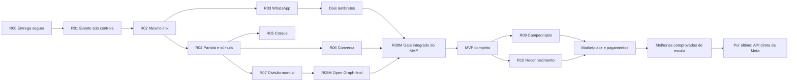

# DeuTime — Roadmap executivo

> Atualizado em 12 de agosto de 2026.

Este é o índice curto de direção e sequência. O detalhamento funcional está no [Catálogo de capacidades](backlog.md), as regras estáveis no [Contexto canônico](product-context.md) e a execução no [Playbook](development.md).

**Legenda:** ✅ concluído · 🟡 em execução · ⬜ planejado · ⚪ horizonte futuro

## Objetivo do MVP

O **MVP funcional completo** permite que um time real execute pelo celular e pelo WhatsApp o ciclo inteiro, com fallback manual:

**elenco → evento → chamada → confirmação → lembretes → divisão dos times → partida → súmula → Craque da Galera → conversa → histórico**

O MVP é considerado completo para **piloto controlado**, não para disponibilidade geral em escala. Nenhuma etapa pode depender de intervenção no banco, expor dados sem consentimento ou perder a operação quando WhatsApp, tempo real, vídeo, votação ou conversa estiverem desligados.

**Estado atual:** ✅ o MVP funcional para piloto controlado foi concluído na R08M. A R09 é a única vertical ativa: pontos corridos, grupos e mata-mata passaram por CP2, a flag continua desligada e nenhum time foi ativado.

## Estado executivo

| Release | Estado | Resultado comprovado | Pacote |
|---|---|---|---|
| **R00 — Fundação de entrega** | ✅ `done` | Flags por time, kill switches, deploy compatível, smoke e rollback do fluxo local + produção. | [Abrir](releases/R00-fundacao-de-entrega.md) |
| **R01 — Evento sob controle** | ✅ `completed` | Fuso autoritativo, edição, remarcação e cancelamento sem apagar histórico. | [Abrir](releases/R01-evento-sob-controle.md) |
| **R02 — Confirmação pelo link** | ✅ `completed` | URL estável, acesso duradouro e revogável, SIM/NÃO/TALVEZ e validação móvel. | [Abrir](releases/R02-confirmacao-pelo-link.md) |
| **R03 — WhatsApp ponta a ponta** | ✅ `completed` | Sender oficial, template, envio, retry seguro, callback, observabilidade e fallback manual. | [Abrir](releases/R03-whatsapp-ponta-a-ponta.md) |
| **R04 — Partida ao vivo e pós-jogo** | ✅ `completed` | Partidas 0..N por evento, presença real, YouTube/Vimeo, placar, lances, timeline e súmula auditável. | [Abrir](releases/R04-partida-ao-vivo-e-pos-jogo.md) |
| **R05 — Craque da Galera** | ✅ `completed` | Voto único anônimo, autovoto, janela de até 12 h, resultado agregado e retenção segura. | [Abrir](releases/R05-craque-da-galera.md) |
| **R06 — Conversa da súmula** | ✅ `completed` | Jornada privada, moderação, retenção, iPhone/Android, rollout controlado e rollback comprovados. | [Abrir](releases/R06-conversa-da-sumula.md) |
| **R03R — Lembretes econômicos** | ✅ `completed` | Duas cotas configuráveis, somente para pendentes, com envio manual/automático idempotente e custo agregado. | [Abrir](releases/R03R-lembretes-economicos.md) |
| **R07 — Times reutilizáveis e divisão compartilhável** | ✅ `completed` | Equipes reutilizáveis, sugestão, publicação, primeiros nomes, formação visual e jornada por toque validadas em produção. | [Abrir](releases/R07-times-manuais-compartilhaveis.md) |
| **R08M — Fechamento do MVP compartilhável** | ✅ `completed` | Open Graph por fase, piloto compartilhável, ciclo integrado, falhas e fallbacks comprovados. | [Abrir](releases/R08M-fechamento-mvp-compartilhavel.md) |
| **R09 — Campeonatos e tabela** | 🟡 `active / CP2` | Três formatos mobile, geração/publicação idempotente, classificação, byes, avanço e decisões eliminatórias concluídos; página compartilhável é o próximo pacote. | [Abrir](releases/R09-campeonatos-e-tabela.md) |

## Cronograma consolidado

| Ordem | Situação | Entrega |
|---|---|---|
| 1. Fundação e evento | ✅ concluído | R00 e R01 estabeleceram deploy controlado, flags, rollback, edição, remarcação e cancelamento com histórico. |
| 2. Link e WhatsApp | ✅ concluído | R02 e R03 entregaram acesso duradouro, confirmação pelo mesmo link, sender oficial, envio, retry, callback e fallback manual. |
| 3. Jogo e pós-jogo | ✅ concluído | R04, R05 e R06 entregaram partida ao vivo, súmula, Craque da Galera e conversa segura. |
| 4. Lembretes econômicos | ✅ concluído | R03R entregou duas cotas automáticas ou manuais somente para quem ainda não confirmou, sem duplicidade. |
| 5. Divisão compartilhável | ✅ concluído | R07 comprovou equipes internas, sugestão, publicação, formação visual, jornada por toque e rollback em Android/iPhone. |
| 6. Fechamento do MVP | ✅ concluído | R08M concluiu Open Graph por fase, previews físicos, piloto, rollback e o gate integrado do ciclo completo. |
| 7. Descoberta pós-MVP | 🟡 contínua, sem implementação | Reunir recomendações, evidências, métricas, dependências e critérios de aceite; eliminar duplicidades e separar requisito de ideia. |
| 8. Evoluções de produto | 🟡 R09 ativa | Executar campeonatos como única vertical; reconhecimento será reavaliado após o piloto e marketplace exige densidade. |
| 9. Consolidação e escala | ⬜ depois das verticais | Executar somente as melhorias transversais priorizadas por risco, uso real ou retorno mensurável. |
| 10. Última evolução técnica | ⚪ por último | Revalidar os requisitos e somente então migrar a mensageria da Twilio para a WhatsApp Cloud API direta da Meta. |

## Entregas do MVP concluídas

### 1. R06 concluída — conversa segura

- [x] `AC-R06-08`: staff oculta e restaura conteúdo com motivo e auditoria, sem registrar o corpo integral;
- [x] `AC-R06-09`: limites antiabuso e limpeza transacional após dois anos foram comprovados sem vazamento em logs;
- [x] runbook de retenção, falha e rollback publicado; cron diário retorna somente contadores redigidos;
- [x] jornada física validada em iPhone e Android, incluindo comentário, resposta, denúncia, remoção e moderação;
- [x] piloto e rollback concluídos: `comments` voltou a ficar desligada em todos os times, preservando histórico, placar, lances e auditoria;
- [x] CP6 concluído: evidências consolidadas, rollout futuro definido, R06 concluída e checkpoint em `idle`.

### 2. R03R concluída — dois lembretes econômicos pelo WhatsApp

- [x] permitir ao time configurar dois lembretes de confirmação e fazer cada evento herdar ou ajustar esses horários;
- [x] recalcular os destinatários no envio e incluir somente elegíveis que ainda não responderam **SIM**, **NÃO** nem **TALVEZ**;
- [x] permitir **Enviar lembrete agora**, consumindo e cancelando a próxima cota automática sem criar um terceiro envio;
- [x] não consumir a cota manual quando não houver destinatário; execução automática vazia termina como `skipped`, sem chamada ao provedor;
- [x] garantir no máximo uma mensagem por atleta e cota, inclusive em clique repetido, retry, concorrência e webhook reprocessado;
- [x] cancelar ou reagendar cotas diante de remarcação, cancelamento, prazo encerrado, opt-out, telefone inválido ou vínculo removido;
- [x] mostrar ao admin estado, destinatários, entrega, falhas e custo agregado de cada cota, preservando o compartilhamento manual.

### 3. R07 concluída — divisão manual e escalação compartilhável

- [x] criar de 2 a 12 equipes ou camisas no evento e distribuir somente atletas confirmados elegíveis;
- [x] concluir em Android e iPhone a validação física de colocar, mover, retirar e recolocar por toque, com alternativa acessível sem arrastar;
- [x] salvar a divisão e sua relação com cada partida sem misturar RSVP, escalação e presença real;
- [x] publicar a escalação no mesmo link somente após confirmação explícita do admin;
- [x] gerar uma imagem com identidade DeuTime, primeiros nomes consentidos, cores, formação visual e fallback de escudo, pronta para o WhatsApp;
- [x] manter lista de confirmados como fallback quando a capacidade estiver desligada ou a imagem falhar;
- [x] validar mobile, autorização, RLS, retry, cross-tenant, telemetria e rollback antes do piloto.

### 4. R08M concluída — identidade compartilhável do evento

- [x] mostrar o escudo específico do time na página do evento, com fallback da marca;
- [x] evoluir o Open Graph conforme a fase: chamada, escalação, placar/súmula, votação aberta e resultado;
- [x] incluir somente informações públicas autorizadas — time, modalidade, data, horário, estado e, quando permitido, escalação, placar ou vencedor;
- [x] impedir credencial, identidade sem consentimento, localização privada e endereço personalizado em HTML, imagem, logs, analytics ou `Referer`;
- [x] conferir o preview principalmente no WhatsApp e também em Instagram, Telegram e iMessage.

### 5. R08M concluída — gate integrado do MVP

- [x] executar com um time piloto o ciclo completo, da criação do evento ao pós-jogo, em Android, iPhone e navegador interno do WhatsApp;
- [x] comprovar caminho manual para chamada, confirmação, escalação, súmula e consulta quando cada automação estiver desligada;
- [x] ensaiar cancelamento, remarcação, opt-out, link encaminhado, retry, falha do provedor, tempo real indisponível e rollback por flag;
- [x] validar custos e limites dos disparos, telemetria redigida, suporte e responsáveis por incidentes;
- [x] encerrar todos os pacotes do MVP com critérios, evidências, documentação e checkpoints em `idle`, sem bloqueador conhecido.

## Ordem recomendada para uma única frente

1. ~~promover e entregar o pacote dos dois lembretes~~ — concluído;
2. ~~concluir a validação física e o CP6 da R07~~ — concluído;
3. ~~executar R08M para fechar Open Graph sobre os estados já estabilizados~~ — concluído;
4. ~~executar o gate integrado e declarar o MVP completo~~ — concluído.

Essa ordem preserva o histórico de como o MVP foi fechado. A partir daqui, a sequência passa a ser orientada por uso real e mantém somente uma vertical ativa por vez.

## Próximas entregas e entrada de melhorias

O trabalho pós-MVP começa por **descoberta leve**, sem abrir várias implementações em paralelo. Toda recomendação ou melhoria deve registrar problema observado, público afetado, evidência, benefício esperado, dependências, risco, fallback e critério de aceite. Itens semelhantes são consolidados antes de receber prioridade.

| Sequência | Entrega | Condição para iniciar |
|---|---|---|
| 1 | ~~Selecionar a próxima vertical entre R09 e R10~~ | ✅ R09 selecionada e preparada em CP0 |
| 2 | Entregar a R09 | uma única frente ativa, com piloto e CP6 |
| 3 | Reavaliar a vertical restante e melhorias transversais | dados de uso da entrega anterior e ausência de bloqueador operacional |
| 4 | Descobrir marketplace e pagamentos | densidade real de oferta e demanda, modelo de confiança e viabilidade transacional |
| 5 | Implementar melhorias adiadas que comprovem risco ou retorno | requisitos consolidados e métricas que justifiquem o custo |
| 6 | Migrar da Twilio para a Meta | última entrega; requisitos e preços revalidados imediatamente antes do CP0 |

Levantar requisitos agora não autoriza implementação. Exceções à sequência existem somente para segurança, indisponibilidade, obrigação legal, perda de dados ou custo operacional que ameace a continuidade do produto.

A R09 foi escolhida antes da R10 porque fecha a lacuna observável entre partidas
isoladas e uma competição, reutilizando os contratos estabilizados de partidas e
equipes internas. A escolha prioriza prontidão e continuidade da jornada; o
piloto da R09 deve fornecer os dados de uso para reavaliar reconhecimento.

## Pós-MVP — releases verticais

| Release | Estado | Resultado autossuficiente | Depende de | Decisão antes de promover | Fallback |
|---|---|---|---|---|---|
| **R08 — Divisão automática** | ↪️ `incorporado à R07` | Sugestão reproduzível, ajustável e explicável foi incorporada à jornada de divisão para não entregar uma experiência fragmentada. | R03, R07 | `DEC-BALANCE-OBJECTIVE` | Ajuste manual |
| **R09 — Campeonatos e tabela** | 🟡 `active / CP2` | Campeonato configurável, partidas vinculadas, classificação ou chaveamento e histórico. | R04, R07, R08M | `DEC-CHAMPIONSHIP-MODEL` aceita | Histórico por partida |
| **R10 — Reconhecimento** | ⚪ `não iniciado` | Pontos positivos, Craques e perfis consentidos, sem ranking constrangedor. | R04, R05 | — | Estatísticas básicas |

### R09 — campeonatos configuráveis

Uma pessoa administradora autorizada poderá criar campeonatos em três formatos:

- **pontos corridos**, com pontuação e critérios de desempate configuráveis;
- **fase de grupos + mata-mata**, com classificação por grupo e avanço para o chaveamento;
- **mata-mata**, com confrontos eliminatórios desde a primeira fase.

O campeonato pertence às partidas, não à recorrência do evento. Um evento pode conter vários confrontos, e amistosos continuam sem campeonato. Cancelar uma ocorrência futura libera a partida para remarcação sem apagá-la; cancelar ocorrências futuras de uma série preserva todos os confrontos pendentes. Partida concluída nunca é excluída: anulação ou correção exige motivo, auditoria e recálculo transacional da tabela ou do chaveamento.

A descoberta da R09 foi concluída em `DEC-CHAMPIONSHIP-MODEL`: participantes aceitos, pontuação, desempate, geração e edição de confrontos, empate no mata-mata e publicação mobile-first compartilhável pelo WhatsApp estão fechados. Os três formatos passaram por CP2 sem ativar time; a próxima ação é expor uma projeção anônima mínima e compartilhável sobre o mesmo contrato.

## Fora do MVP entregue

- evoluções do equilíbrio automático, campeonatos, gamificação ampliada e análises avançadas;
- marketplace, pagamentos, árbitros, quadras, churrasco e descoberta aberta de atletas;
- PWA, chat geral, mensagens privadas, anexos e ingestão automática de vídeo;
- migração da Twilio para a WhatsApp Cloud API direta da Meta, enquanto custo e escala não justificarem a troca;
- staging completo, Terraform com state importado, automação E2E generalizada e melhorias técnicas já registradas como adiadas no MVP.

Esses itens não fizeram parte do gate do piloto funcional. Segurança e operação para disponibilidade geral devem ser reavaliadas antes de ampliar a escala, incluindo pentest independente, restauração comprovada, observabilidade ampliada e obrigações de LGPD.

## Horizonte exploratório — marketplace do futebol amador

Depois que o ciclo principal estiver validado e houver densidade de times, atletas e partidas, o DeuTime poderá evoluir para um marketplace capaz de:

- encontrar e contratar árbitros e organizadores;
- encontrar e reservar quadras e campos;
- encontrar empresas de churrasco, alimentação e serviços do pós-jogo;
- descobrir e convidar outros atletas com privacidade e consentimento;
- cobrar, dividir e repassar pagamentos do racha;
- gerar receita transacional sobre reservas, contratações e pagamentos.

Este horizonte não recebe release, prazo ou implementação agora. Sua promoção exige validar oferta, demanda, confiança, reputação, moderação, suporte, pagamentos, antifraude, identidade, tributação e LGPD.

## Última evolução planejada — WhatsApp Cloud API direta da Meta

Esta é deliberadamente a **última entrega do cronograma**. Ela só entra em descoberta formal e CP0 depois do MVP concluído e das evoluções de produto priorizadas, inclusive campeonatos, reconhecimento e marketplace. Até lá, o fluxo comprovado permanece na Twilio com compartilhamento manual como fallback.

O levantamento inicial pode acontecer agora, sem desenho definitivo nem implementação. Ele deve manter um registro curto de:

- volume mensal por tipo de mensagem, destinatários efetivos, entrega, leitura, falha e custo total;
- tarifas da Twilio e da Meta separadas, câmbio e ponto de equilíbrio estimado;
- titularidade do número, WABA, Business Manager, templates e possibilidade de migração ou coexistência;
- requisitos de credenciais, permissões, webhook, qualidade, limites, suporte e resposta a incidentes;
- compatibilidade com outbox, worker agendado, envio manual, idempotência, retry, kill switches e fallback;
- riscos, dúvidas abertas e fontes oficiais com data de consulta.

Esse registro é insumo, não especificação executável. Preços, API, permissões, templates, limites e processo de migração devem ser pesquisados novamente quando essa entrega for promovida a CP0.

A integração direta é uma evolução de custo e escala. A tarifa da Meta continua existindo; o ganho esperado é retirar a cobrança adicional e a camada operacional da Twilio. Antes de promover o trabalho, o DeuTime deve calcular o ponto de equilíbrio com volume real de chamadas e lembretes, verificar a titularidade e a migração do número atual e confirmar templates, limites e qualidade da conta na Meta.

O contrato interno permanece provider-neutral. A mudança alcança somente as bordas da integração: adapter de envio pela Graph API, catálogo de templates da Meta, credenciais, webhook assinado de status e seleção do provedor por configuração. Outbox, destinatários elegíveis, duas cotas, envio manual, deduplicação, idempotência, retry, observabilidade e kill switches continuam compartilhados.

O consumo assíncrono exige um **worker ativo**, mas não um processo dedicado permanentemente ligado. Um agendador pode chamar periodicamente o endpoint protegido para produzir lembretes vencidos e consumir a fila; o modelo atual de execução a cada 15 minutos pode ser preservado. Envios manuais podem acordar o mesmo consumidor sob demanda. Já os estados `sent`, `delivered`, `read` e `failed` chegam por webhook da Meta e não dependem do ciclo do worker.

Quando chegar sua vez, a promoção seguirá expansão inerte e piloto controlado:

- adicionar o adapter Meta desligado, mantendo a Twilio como fallback;
- impedir envio duplicado entre provedores e preservar a correlação de cada tentativa;
- validar assinatura e replay do webhook, renovação de credenciais, rate limits, retry e telemetria redigida;
- testar um número e um time piloto em Android, iPhone e navegador interno do WhatsApp;
- migrar apenas novos itens da fila por operação explícita e auditável;
- retirar a Twilio somente após comparar custo, entrega, leitura, falhas e recuperação operacional.

## Caminho crítico

## Regras de promoção

- somente a release ativa e a imediatamente seguinte recebem pacote detalhado;
- uma frente mantém uma única release vertical ativa;
- cada pacote passa pela Definition of Ready do playbook e pelos checkpoints CP0–CP6;
- release nova nasce desligada, com piloto, telemetria, fallback e rollback;
- banco e aplicação toleram as duas ordens de deploy e migrations são forward-only;
- segurança, privacidade, mobile, WhatsApp, documentação e operação são gates de cada release;
- ao concluir, evidências atualizam o pacote, os fatos `BASE-*`, este roadmap e o checkpoint volta a `idle`.
