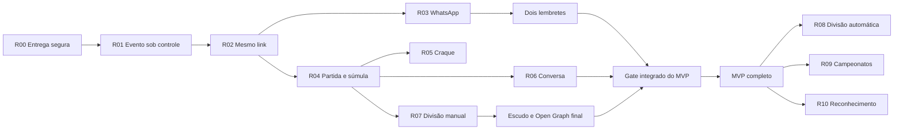

# DeuTime — Roadmap executivo

> Atualizado em 8 de agosto de 2026.

Este é o índice curto de direção e sequência. O detalhamento funcional está no [Catálogo de capacidades](backlog.md), as regras estáveis no [Contexto canônico](product-context.md) e a execução no [Playbook](development.md).

**Legenda:** ✅ concluído · 🟡 em execução · ⬜ falta para o MVP · ⚪ pós-MVP

## Objetivo do MVP

O **MVP funcional completo** permite que um time real execute pelo celular e pelo WhatsApp o ciclo inteiro, com fallback manual:

**elenco → evento → chamada → confirmação → lembretes → divisão dos times → partida → súmula → Craque da Galera → conversa → histórico**

O MVP é considerado completo para **piloto controlado**, não para disponibilidade geral em escala. Nenhuma etapa pode depender de intervenção no banco, expor dados sem consentimento ou perder a operação quando WhatsApp, tempo real, vídeo, votação ou conversa estiverem desligados.

## Estado executivo

| Release | Estado | Resultado comprovado | Pacote |
|---|---|---|---|
| **R00 — Fundação de entrega** | ✅ `done` | Flags por time, kill switches, deploy compatível, smoke e rollback do fluxo local + produção. | [Abrir](releases/R00-fundacao-de-entrega.md) |
| **R01 — Evento sob controle** | ✅ `completed` | Fuso autoritativo, edição, remarcação e cancelamento sem apagar histórico. | [Abrir](releases/R01-evento-sob-controle.md) |
| **R02 — Confirmação pelo link** | ✅ `completed` | URL estável, acesso duradouro e revogável, SIM/NÃO/TALVEZ e validação móvel. | [Abrir](releases/R02-confirmacao-pelo-link.md) |
| **R03 — WhatsApp ponta a ponta** | ✅ `completed` | Sender oficial, template, envio, retry seguro, callback, observabilidade e fallback manual. | [Abrir](releases/R03-whatsapp-ponta-a-ponta.md) |
| **R04 — Partida ao vivo e pós-jogo** | ✅ `completed` | Partidas 0..N por evento, presença real, YouTube/Vimeo, placar, lances, timeline e súmula auditável. | [Abrir](releases/R04-partida-ao-vivo-e-pos-jogo.md) |
| **R05 — Craque da Galera** | ✅ `completed` | Voto único anônimo, autovoto, janela de até 12 h, resultado agregado e retenção segura. | [Abrir](releases/R05-craque-da-galera.md) |
| **R06 — Conversa da súmula** | ✅ `completed` | Jornada privada, moderação, retenção, iPhone/Android, rollout controlado e rollback comprovados. | [Abrir](releases/R06-conversa-da-sumula.md) |
| **R03R — Lembretes econômicos** | ✅ `completed` | Duas cotas configuráveis, somente para pendentes, com envio manual/automático idempotente e custo agregado. | [Abrir](releases/R03R-lembretes-economicos.md) |
| **R07 — Times manuais compartilháveis** | 🟢 `ready` — CP0 concluído | Transformar confirmados em equipes, escalação e imagem compartilhável sem depender do algoritmo automático. | [Abrir](releases/R07-times-manuais-compartilhaveis.md) |

## O que falta para o MVP completo

### 1. R06 concluída — conversa segura

- [x] `AC-R06-08`: staff oculta e restaura conteúdo com motivo e auditoria, sem registrar o corpo integral;
- [x] `AC-R06-09`: limites antiabuso e limpeza transacional após dois anos foram comprovados sem vazamento em logs;
- [x] runbook de retenção, falha e rollback publicado; cron diário retorna somente contadores redigidos;
- [x] jornada física validada em iPhone e Android, incluindo comentário, resposta, denúncia, remoção e moderação;
- [x] piloto e rollback concluídos: `comments` voltou a ficar desligada em todos os times, preservando histórico, placar, lances e auditoria;
- [x] CP6 concluído: evidências consolidadas, rollout futuro definido, R06 concluída e checkpoint em `idle`.

### 2. R03R concluída — dois lembretes econômicos pelo WhatsApp

- [x] permitir ao time configurar dois lembretes de confirmação e fazer cada evento herdar ou ajustar esses horários;
- [x] recalcular os destinatários no envio e incluir somente elegíveis que ainda não responderam **SIM**, **NÃO** nem **TALVEZ**;
- [x] permitir **Enviar lembrete agora**, consumindo e cancelando a próxima cota automática sem criar um terceiro envio;
- [x] não consumir a cota manual quando não houver destinatário; execução automática vazia termina como `skipped`, sem chamada ao provedor;
- [x] garantir no máximo uma mensagem por atleta e cota, inclusive em clique repetido, retry, concorrência e webhook reprocessado;
- [x] cancelar ou reagendar cotas diante de remarcação, cancelamento, prazo encerrado, opt-out, telefone inválido ou vínculo removido;
- [x] mostrar ao admin estado, destinatários, entrega, falhas e custo agregado de cada cota, preservando o compartilhamento manual.

### 3. Entregar R07 — divisão manual e escalação compartilhável

- [ ] criar de 2 a N equipes ou camisas no evento e distribuir somente atletas confirmados elegíveis;
- [ ] permitir marcar quem fica fora e ajustar a divisão por toque, com alternativa acessível sem arrastar;
- [ ] salvar a divisão e sua relação com cada partida sem misturar RSVP, escalação e presença real;
- [ ] publicar a escalação no mesmo link somente após confirmação explícita do admin;
- [ ] gerar uma imagem com identidade DeuTime, nomes consentidos, cores e fallback de escudo, pronta para o WhatsApp;
- [ ] manter lista de confirmados como fallback quando a capacidade estiver desligada ou a imagem falhar;
- [ ] validar mobile, autorização, RLS, retry, cross-tenant, telemetria e rollback antes do piloto.

### 4. Fechar a identidade compartilhável do evento

- [ ] mostrar o escudo específico do time na página do evento, com fallback da marca;
- [ ] evoluir o Open Graph conforme a fase: chamada, escalação, placar/súmula, votação aberta e resultado;
- [ ] incluir somente informações públicas autorizadas — time, modalidade, data, horário, estado e, quando permitido, escalação, placar ou vencedor;
- [ ] impedir credencial, identidade sem consentimento, localização privada e endereço personalizado em HTML, imagem, logs, analytics ou `Referer`;
- [ ] conferir o preview principalmente no WhatsApp e também em Instagram, Telegram e iMessage.

### 5. Passar pelo gate integrado do MVP

- [ ] executar com um time piloto o ciclo completo, da criação do evento ao pós-jogo, em Android, iPhone e navegador interno do WhatsApp;
- [ ] comprovar caminho manual para chamada, confirmação, escalação, súmula e consulta quando cada automação estiver desligada;
- [ ] ensaiar cancelamento, remarcação, opt-out, link encaminhado, retry, falha do provedor, tempo real indisponível e rollback por flag;
- [ ] validar custos e limites dos disparos, telemetria redigida, suporte e responsáveis por incidentes;
- [ ] encerrar todos os pacotes do MVP com critérios, evidências, documentação e checkpoints em `idle`, sem bloqueador conhecido.

## Ordem recomendada para uma única frente

1. ~~promover e entregar o pacote dos dois lembretes~~ — concluído;
2. promover e entregar R07 com divisão manual, publicação e imagem;
3. fechar escudo e Open Graph sobre os estados já estabilizados;
4. executar o gate integrado e declarar o MVP completo.

Essa ordem termina fatias pequenas antes de abrir a próxima, reutiliza os contratos comprovados e evita que divisão automática, campeonato ou marketplace atrasem o piloto.

## Pós-MVP — releases verticais

| Release | Estado | Resultado autossuficiente | Depende de | Decisão antes de promover | Fallback |
|---|---|---|---|---|---|
| **R08 — Divisão automática** | ⚪ `não iniciado` | Sugestão reproduzível, ajustável e explicável, com afinidades, restrições, equilíbrio e rodízio. | R03, R07 | `DEC-BALANCE-OBJECTIVE` | Divisão manual |
| **R09 — Campeonatos, camisas e tabela** | ⚪ `não iniciado` | Campeonato configurável, partidas vinculadas, classificação ou chaveamento e histórico. | R04, R07 | modelo de campeonato | Histórico por partida |
| **R10 — Reconhecimento** | ⚪ `não iniciado` | Pontos positivos, Craques e perfis consentidos, sem ranking constrangedor. | R04, R05 | — | Estatísticas básicas |

### R09 — campeonatos configuráveis

Uma pessoa administradora autorizada poderá criar campeonatos em três formatos:

- **pontos corridos**, com pontuação e critérios de desempate configuráveis;
- **fase de grupos + mata-mata**, com classificação por grupo e avanço para o chaveamento;
- **mata-mata**, com confrontos eliminatórios desde a primeira fase.

O campeonato pertence às partidas, não à recorrência do evento. Um evento pode conter vários confrontos, e amistosos continuam sem campeonato. Cancelar uma ocorrência futura libera a partida para remarcação sem apagá-la; cancelar ocorrências futuras de uma série preserva todos os confrontos pendentes. Partida concluída nunca é excluída: anulação ou correção exige motivo, auditoria e recálculo transacional da tabela ou do chaveamento.

Antes de promover R09, a descoberta deve fechar participantes aceitos, pontuação, desempate, geração e edição de confrontos, empate no mata-mata e publicação mobile-first compartilhável pelo WhatsApp.

## Não bloqueia o MVP funcional

- divisão automática, campeonatos, gamificação ampliada e análises avançadas;
- marketplace, pagamentos, árbitros, quadras, churrasco e descoberta aberta de atletas;
- PWA, chat geral, mensagens privadas, anexos e ingestão automática de vídeo;
- staging completo, Terraform com state importado, automação E2E generalizada e melhorias técnicas já registradas como adiadas no MVP.

Esses itens não bloqueiam o piloto funcional, mas segurança e operação para disponibilidade geral devem ser reavaliadas antes de ampliar a escala, incluindo pentest independente, restauração comprovada, observabilidade ampliada e obrigações de LGPD.

## Horizonte exploratório — marketplace do futebol amador

Depois que o ciclo principal estiver validado e houver densidade de times, atletas e partidas, o DeuTime poderá evoluir para um marketplace capaz de:

- encontrar e contratar árbitros e organizadores;
- encontrar e reservar quadras e campos;
- encontrar empresas de churrasco, alimentação e serviços do pós-jogo;
- descobrir e convidar outros atletas com privacidade e consentimento;
- cobrar, dividir e repassar pagamentos do racha;
- gerar receita transacional sobre reservas, contratações e pagamentos.

Este horizonte não recebe release, prazo ou implementação agora. Sua promoção exige validar oferta, demanda, confiança, reputação, moderação, suporte, pagamentos, antifraude, identidade, tributação e LGPD.

## Caminho crítico

## Regras de promoção

- somente a release ativa e a imediatamente seguinte recebem pacote detalhado;
- uma frente mantém uma única release vertical ativa;
- cada pacote passa pela Definition of Ready do playbook e pelos checkpoints CP0–CP6;
- release nova nasce desligada, com piloto, telemetria, fallback e rollback;
- banco e aplicação toleram as duas ordens de deploy e migrations são forward-only;
- segurança, privacidade, mobile, WhatsApp, documentação e operação são gates de cada release;
- ao concluir, evidências atualizam o pacote, os fatos `BASE-*`, este roadmap e o checkpoint volta a `idle`.
