# DeuTime — Roadmap executivo

> Atualizado em 3 de setembro de 2026.

Este é o índice curto de direção e sequência. O detalhamento funcional está no [Catálogo de capacidades](backlog.md), as regras estáveis no [Contexto canônico](product-context.md) e a execução no [Playbook](development.md).

**Legenda:** ✅ concluído · 🟡 em execução · ⬜ planejado · ⚪ horizonte futuro

## Objetivo do MVP

O **MVP funcional completo** permite que um time real execute pelo celular e pelo WhatsApp o ciclo inteiro, com fallback manual:

**elenco → evento → chamada → confirmação → lembretes → divisão dos times → partida → súmula → Craque da Galera → conversa → histórico**

O MVP é considerado completo para **piloto controlado**, não para disponibilidade geral em escala. Nenhuma etapa pode depender de intervenção no banco, expor dados sem consentimento ou perder a operação quando WhatsApp, tempo real, vídeo, votação ou conversa estiverem desligados.

**Estado atual:** ✅ o MVP funcional para piloto controlado foi concluído na
R08M, e R09, R10, R12 e R13 encerraram CP6. A fundação recebeu três melhorias concluídas
em produção: recuperação de senha corrigida, branding dos e-mails de autenticação
e edição segura do perfil pós-login. As pendências observadas de confiança,
autonomia da conta, agenda e experiência de competições foram consolidadas nas
releases R12 e R13. Elas precedem a R11, que continua
como proposta de assinatura mensal por time via Asaas, com CP0 pendente;
marketplace, cobrança de atletas, split e repasse permanecem fora da proposta.
O rollout pré-lançamento foi concluído em 25 de agosto: os 5 times possuem as
15 capacidades validadas ativas, com 75/75 flags, 3/3 controles globais,
worker e smoke aprovados. A R12 concluiu em produção seu contrato de confiança,
privacidade e autonomia, incluindo opções do evento, piloto SES, fallback e
rollback. A R13 foi publicada, reconciliada e encerrada. A próxima frente única
é o `DP-R11-01`: validar contratos e políticas no Sandbox do Asaas sem alterar
schema ou produção.

## Estado executivo

| Release | Estado | Resultado comprovado | Pacote |
|---|---|---|---|
| **R00 — Fundação de entrega** | ✅ `done` — ampliada | Flags, kill switches, deploy, recuperação, e-mails com a marca, perfil pós-login e catálogo integral ativo em produção. | [Abrir](releases/R00-fundacao-de-entrega.md) |
| **R01 — Evento sob controle** | ✅ `completed` | Fuso autoritativo, edição, remarcação e cancelamento sem apagar histórico. | [Abrir](releases/R01-evento-sob-controle.md) |
| **R02 — Confirmação pelo link** | ✅ `completed` | URL estável, acesso duradouro e revogável, SIM/NÃO/TALVEZ e validação móvel. | [Abrir](releases/R02-confirmacao-pelo-link.md) |
| **R03 — WhatsApp ponta a ponta** | ✅ `completed` | Sender oficial, template, envio, retry seguro, callback, observabilidade e fallback manual. | [Abrir](releases/R03-whatsapp-ponta-a-ponta.md) |
| **R04 — Partida ao vivo e pós-jogo** | ✅ `completed` | Partidas 0..N por evento, presença real, YouTube/Vimeo, placar, lances, timeline e súmula auditável. | [Abrir](releases/R04-partida-ao-vivo-e-pos-jogo.md) |
| **R05 — Craque da Galera** | ✅ `completed` | Voto único anônimo, autovoto, janela de até 12 h, resultado agregado e retenção segura. | [Abrir](releases/R05-craque-da-galera.md) |
| **R06 — Conversa da súmula** | ✅ `completed` | Jornada privada, moderação, retenção, iPhone/Android, rollout controlado e rollback comprovados. | [Abrir](releases/R06-conversa-da-sumula.md) |
| **R03R — Lembretes econômicos** | ✅ `completed` | Duas cotas configuráveis, somente para pendentes, com envio manual/automático idempotente e custo agregado. | [Abrir](releases/R03R-lembretes-economicos.md) |
| **R07 — Times reutilizáveis e divisão compartilhável** | ✅ `completed` | Equipes reutilizáveis, sugestão, publicação, primeiros nomes, formação visual e jornada por toque validadas em produção. | [Abrir](releases/R07-times-manuais-compartilhaveis.md) |
| **R08M — Fechamento do MVP compartilhável** | ✅ `completed` | Open Graph por fase, piloto compartilhável, ciclo integrado, falhas e fallbacks comprovados. | [Abrir](releases/R08M-fechamento-mvp-compartilhavel.md) |
| **R09 — Campeonatos e tabela** | ✅ `completed / CP6` | Três formatos, classificação, chave, página anônima, robustez, piloto e sonda protegida concluídos. | [Abrir](releases/R09-campeonatos-e-tabela.md) |
| **R10 — Reconhecimento positivo** | ✅ `done / CP6` | Modelo factual, visão privada, resumo consentido, revogação, piloto isolado, smokes e rollback comprovados. | [Abrir](releases/R10-reconhecimento-positivo.md) |
| **Rollout pré-lançamento** | ✅ `done / produção` | 15 capacidades ativas nos 5 times, com 75/75 flags, 3/3 controles, auditoria, worker, smoke e rollback disponíveis. | [Evidência](releases/R00-fundacao-de-entrega.md#evidências-e-checkpoint) |
| **R12 — Confiança e autonomia** | ✅ `done / CP6` | Privacidade, vínculos, encerramento, aviso SES, opções do evento, compatibilidade, mobile, piloto e rollback comprovados. | [Abrir](releases/R12-confianca-e-autonomia.md) |
| **R13 — Agenda e competições profissionais** | ✅ `completed / CP6` | Jogo, recorrência e campeonato separados; equipes reutilizáveis, regulamento versionado, conflitos acionáveis, piloto, smoke e rollback comprovados. | [Abrir](releases/R13-agenda-e-competicoes-profissionais.md) |
| **R11 — Assinatura pelo Asaas** | 🟡 `discovery / CP0` | Assinatura mensal por time, entitlement local e liberação dos benefícios pagos por evento verificado, com Asaas atrás de adapter substituível. | [Abrir](releases/R11-assinatura-asaas.md) |

## Política temporária de ambientes

Até nova orientação explícita do responsável pelo produto, o DeuTime trabalha
com **produção como único ambiente integrado**. O objetivo é refinar o produto
real antes do lançamento público sem manter uma passagem paralela por staging.

- Não executar deploy, migration, seed, smoke, piloto, teste manual ou
  configuração no ambiente de staging; ele só volta ao fluxo após autorização
  explícita do responsável pelo produto.
- Desenvolvimento local, lint, typecheck, testes automatizados, banco local e
  revisão de diff continuam obrigatórios antes de qualquer alteração em produção.
- Toda expansão de banco continua inerte, forward-only e compatível com as
  duas ordens de deploy; aplicação, RLS, autorização e rollback são verificados
  diretamente em produção com escopo controlado.
- Feature flags e kill switches permanecem como mecanismos de segurança e
  recuperação, não como forma de deixar indefinidamente uma funcionalidade
  concluída indisponível.
- Para releases novas, `done` exige ativação global e smoke produtivo; código
  implantado, mas desligado, continua `pilot` ou `rollout`.
- Pilotos acontecem em produção, primeiro em um time de validação identificado
  e depois em todos os times, sem criar um ambiente intermediário informal.
- Dados de validação em produção devem ser mínimos, identificáveis para
  limpeza segura e nunca podem reutilizar dados pessoais reais sem necessidade.
- O sandbox de um provedor externo regulado, como o Asaas, não cria um
  ambiente de staging do DeuTime; seu uso futuro continua restrito à validação do
  contrato sem cobrança real e será reavaliado no CP0 da integração.

### Rollout integral das capacidades concluídas

- [x] Inventariar flags globais, overrides por time, coortes, kill switches,
  variáveis de ambiente e consumidores assíncronos que ainda limitem uma
  capacidade marcada como concluída.
- [x] Separar **concluída e pronta para liberação** de **planejada, incompleta ou
  experimental**; somente a primeira categoria entra neste rollout.
- [x] Ativar em produção, para todos os times elegíveis, campeonatos, conversa da
  súmula, reconhecimento positivo e qualquer outra capacidade concluída ainda
  desligada, usando operação explícita, idempotente e auditável.
- [x] Verificar páginas administrativas e públicas, autorização, RLS,
  isolamento multi-time, cron, filas, webhooks, e-mail e WhatsApp aplicáveis.
- [x] Executar smoke produtivo do ciclo completo pelo celular e pelo navegador
  interno do WhatsApp, incluindo um caso negativo e o rollback por kill switch.
- [x] Confirmar que não restou feature concluída limitada a coorte, override ou
  flag desligada; registrar a exceção com motivo e responsável caso segurança ou
  dependência externa impeça uma ativação.
- [x] Manter a liberação ativa após a verificação. Rollback só ocorre por falha
  observada e gera correção prioritária, não encerramento definitivo desligado.

## Cronograma consolidado

| Ordem | Situação | Entrega |
|---|---|---|
| 1. Fundação e evento | ✅ concluído | R00 e R01 estabeleceram deploy controlado, flags, rollback, edição, remarcação e cancelamento com histórico. |
| 2. Link e WhatsApp | ✅ concluído | R02 e R03 entregaram acesso duradouro, confirmação pelo mesmo link, sender oficial, envio, retry, callback e fallback manual. |
| 3. Jogo e pós-jogo | ✅ concluído | R04, R05 e R06 entregaram partida ao vivo, súmula, Craque da Galera e conversa segura. |
| 4. Lembretes econômicos | ✅ concluído | R03R entregou duas cotas automáticas ou manuais somente para quem ainda não confirmou, sem duplicidade. |
| 5. Divisão compartilhável | ✅ concluído | R07 comprovou equipes internas, sugestão, publicação, formação visual, jornada por toque e rollback em Android/iPhone. |
| 6. Fechamento do MVP | ✅ concluído | R08M concluiu Open Graph por fase, previews físicos, piloto, rollback e o gate integrado do ciclo completo. |
| 7. Descoberta pós-MVP | ✅ requisitos consolidados | Recomendações foram separadas em correções de confiança e evolução da experiência profissional, sem reabrir releases históricas. |
| 8. Evoluções de produto | ✅ R09 e R10 em CP6 | Campeonatos e reconhecimento positivo concluídos com pilotos, smokes, fallbacks e rollback. |
| 9. Conta e autenticação | ✅ melhoria concluída | Recuperação publicada, três e-mails com branding e edição do perfil em `/app/profile`, com produção e mobile validados. |
| 10. Rollout pré-lançamento | ✅ concluído | Catálogo validado ativo globalmente, com 75/75 flags, controles, auditoria, worker, smoke e rollback disponíveis. |
| 11. Confiança e autonomia | 🟡 R12 ativa / WP-R12-04 concluído | Rotas, privacidade, vínculos, encerramento e aviso de cadastro entregues; executar opções do evento. |
| 12. Agenda profissional | ⬜ R13 planejada | Entregar criação clara de jogo ou campeonato, missão com duas equipes, regulamento configurável e gestão manual de conflitos. |
| 13. Monetização do DeuTime | ⬜ R11 proposta | Validar no sandbox assinatura mensal por time via Asaas somente depois de R12 e R13; manter cobrança separada do marketplace. |
| 14. Consolidação e escala | ⬜ decisão pendente | Priorizar somente melhorias com risco, uso real ou retorno mensurável. |
| Opcional — troca de provedor | ⚪ sem posição no cronograma | Avaliar a WhatsApp Cloud API direta da Meta somente se custo, escala ou requisito operacional justificarem; a Twilio permanece como provedora de produção. |

## Entregas do MVP concluídas

### 1. R06 concluída — conversa segura

- [x] `AC-R06-08`: staff oculta e restaura conteúdo com motivo e auditoria, sem registrar o corpo integral;
- [x] `AC-R06-09`: limites antiabuso e limpeza transacional após dois anos foram comprovados sem vazamento em logs;
- [x] runbook de retenção, falha e rollback publicado; cron diário retorna somente contadores redigidos;
- [x] jornada física validada em iPhone e Android, incluindo comentário, resposta, denúncia, remoção e moderação;
- [x] piloto e rollback concluídos: `comments` voltou a ficar desligada em todos os times, preservando histórico, placar, lances e auditoria;
- [x] CP6 concluído: evidências consolidadas, rollout futuro definido, R06 concluída e checkpoint em `idle`.

### 2. R03R concluída — dois lembretes econômicos pelo WhatsApp

- [x] permitir ao time configurar dois lembretes de confirmação e fazer cada evento herdar ou ajustar esses horários;
- [x] recalcular os destinatários no envio e incluir somente elegíveis que ainda não responderam **SIM**, **NÃO** nem **TALVEZ**;
- [x] permitir **Enviar lembrete agora**, consumindo e cancelando a próxima cota automática sem criar um terceiro envio;
- [x] não consumir a cota manual quando não houver destinatário; execução automática vazia termina como `skipped`, sem chamada ao provedor;
- [x] garantir no máximo uma mensagem por atleta e cota, inclusive em clique repetido, retry, concorrência e webhook reprocessado;
- [x] cancelar ou reagendar cotas diante de remarcação, cancelamento, prazo encerrado, opt-out, telefone inválido ou vínculo removido;
- [x] mostrar ao admin estado, destinatários, entrega, falhas e custo agregado de cada cota, preservando o compartilhamento manual.

### 3. R07 concluída — divisão manual e escalação compartilhável

- [x] criar de 2 a 12 equipes ou camisas no evento e distribuir somente atletas confirmados elegíveis;
- [x] concluir em Android e iPhone a validação física de colocar, mover, retirar e recolocar por toque, com alternativa acessível sem arrastar;
- [x] salvar a divisão e sua relação com cada partida sem misturar RSVP, escalação e presença real;
- [x] publicar a escalação no mesmo link somente após confirmação explícita do admin;
- [x] gerar uma imagem com identidade DeuTime, primeiros nomes consentidos, cores, formação visual e fallback de escudo, pronta para o WhatsApp;
- [x] manter lista de confirmados como fallback quando a capacidade estiver desligada ou a imagem falhar;
- [x] validar mobile, autorização, RLS, retry, cross-tenant, telemetria e rollback antes do piloto.

### 4. R08M concluída — identidade compartilhável do evento

- [x] mostrar o escudo específico do time na página do evento, com fallback da marca;
- [x] evoluir o Open Graph conforme a fase: chamada, escalação, placar/súmula, votação aberta e resultado;
- [x] incluir somente informações públicas autorizadas — time, modalidade, data, horário, estado e, quando permitido, escalação, placar ou vencedor;
- [x] impedir credencial, identidade sem consentimento, localização privada e endereço personalizado em HTML, imagem, logs, analytics ou `Referer`;
- [x] conferir o preview principalmente no WhatsApp e também em Instagram, Telegram e iMessage.

### 5. R08M concluída — gate integrado do MVP

- [x] executar com um time piloto o ciclo completo, da criação do evento ao pós-jogo, em Android, iPhone e navegador interno do WhatsApp;
- [x] comprovar caminho manual para chamada, confirmação, escalação, súmula e consulta quando cada automação estiver desligada;
- [x] ensaiar cancelamento, remarcação, opt-out, link encaminhado, retry, falha do provedor, tempo real indisponível e rollback por flag;
- [x] validar custos e limites dos disparos, telemetria redigida, suporte e responsáveis por incidentes;
- [x] encerrar todos os pacotes do MVP com critérios, evidências, documentação e checkpoints em `idle`, sem bloqueador conhecido.

## Ordem recomendada para uma única frente

1. executar a R12 e corrigir primeiro rotas, endereço público, textos de compartilhamento e ação duplicada do dashboard;
2. ainda na R12, fechar consentimento, saída de vínculos, encerramento da conta, e-mail de novo cadastro e opções do evento;
3. estabilizar e ativar globalmente a R12 em produção, com regressão dos links existentes e privacidade comprovada;
4. promover a R13 e entregar a nova entrada **Novo jogo** ou **Novo campeonato**;
5. incluir as duas equipes reutilizáveis na Missão de estreia e nos padrões de criação;
6. concluir desempates configuráveis, detecção de conflitos, adiamento e cancelamento coerentes;
7. ativar globalmente a R13 em produção e somente então retomar o CP0 da R11 no sandbox do Asaas.

Essa ordem corrige primeiro confiança, privacidade e perda de gestão; depois
organiza a operação esportiva; por último adiciona monetização. Uma única release
fica ativa por vez.

## Próximas entregas e entrada de melhorias

O trabalho pós-MVP começa por **descoberta leve**, sem abrir várias implementações em paralelo. Toda recomendação ou melhoria deve registrar problema observado, público afetado, evidência, benefício esperado, dependências, risco, fallback e critério de aceite. Itens semelhantes são consolidados antes de receber prioridade.

| Sequência | Entrega | Condição para iniciar |
|---|---|---|
| 1 | ~~Selecionar a próxima vertical entre R09 e R10~~ | ✅ R09 selecionada e preparada em CP0 |
| 2 | ~~Concluir a R09~~ | ✅ CP6, sonda protegida e documentação concluídos |
| 3 | ~~Reavaliar a vertical restante e melhorias transversais~~ | ✅ R10 preparada em CP0 após contrato aceito e sinal de uso `3/3` |
| 4 | ~~Expandir a R10 de forma inerte~~ | ✅ CP1 concluído sem interface, consumidor, time ativado ou efeito externo |
| 5 | ~~Entregar a visão privada móvel da R10~~ | ✅ `WP-R10-02` concluído |
| 6 | ~~Entregar o resumo público consentido~~ | ✅ `WP-R10-03` concluído |
| 7 | ~~Concluir robustez e piloto da R10~~ | ✅ `WP-R10-04` e CP6 concluídos; feature desligada após rollback |
| 8 | ~~[Levantar a próxima decisão pós-R10](discovery/post-r10-next-decision.md)~~ | ✅ primeiro snapshot terminou sem promoção por densidade insuficiente |
| 9 | ~~Liberar o catálogo concluído em produção~~ | ✅ 75/75 flags, 3/3 controles, auditoria, worker, smoke e rollback comprovados |
| 10 | ~~Promover e executar R12~~ | ✅ CP6, sonda agregada, piloto SES, fallback e rollback concluídos em produção |
| 11 | ~~Executar R13 a partir de WP-R13-01~~ | ✅ CP6, produção, smoke, sonda agregada, fallback e rollback concluídos |
| 12 | Validar a proposta R11 no sandbox do Asaas | R12 e R13 concluídas e ativas em produção; oferta, checkout, preço, assinatura existente, webhook, cancelamento e reativação comprovados |
| 13 | Promover e executar R11 | somente depois do CP0, como única release ativa, com adapter, piloto produtivo e fallback manual |
| 14 | Descobrir marketplace e cobrança dos atletas | densidade real de oferta e demanda, regulação, contabilidade, confiança e viabilidade transacional |
| 15 | Implementar melhorias adiadas que comprovem risco ou retorno | requisitos consolidados e métricas que justifiquem o custo |
| Opcional | Avaliar migração da Twilio para a Meta | fora do caminho crítico; somente com ponto de equilíbrio ou necessidade operacional comprovados e requisitos revalidados antes do CP0 |

Levantar requisitos agora não autoriza implementação. Exceções à sequência existem somente para segurança, indisponibilidade, obrigação legal, perda de dados ou custo operacional que ameace a continuidade do produto.

### Situação das entregas em 26 de agosto de 2026

- [x] MVP compartilhável encerrado em R08M;
- [x] campeonatos encerrados em R09/CP6, com a capacidade preservada atrás de flag;
- [x] reconhecimento positivo encerrado em R10/CP6, privado por padrão e desligado após o piloto;
- [x] executar o primeiro snapshot agregado pós-R10, sem PII, com decisão `sem promoção` por densidade insuficiente;
- [x] registrar R11 como proposta de assinatura do DeuTime pelo Asaas, sem iniciar implementação;
- [x] consolidar os bugs e as melhorias operacionais nas propostas R12 e R13, sem alterar o estado das releases concluídas;
- [x] definir produção como único ambiente integrado até nova autorização explícita para usar staging;
- [x] inventariar e ativar globalmente em produção todas as capacidades concluídas ainda limitadas por flag, coorte ou piloto;
- [x] promover R12 após o rollout integral e fechar seu CP0;
- [x] executar os pacotes da R12 em uma única frente;
- [x] promover R13 somente depois da estabilização da R12;
- [ ] executar o CP0 da R11 no sandbox e fechar decisões comerciais e operacionais depois de R12 e R13 — descoberta iniciada; chave exclusiva do Sandbox e decisões comerciais pendentes;
- [ ] promover R11 como única release ativa somente se a Definition of Ready for satisfeita;
- [ ] manter marketplace condicionado à densidade e a migração para a Meta como tarefa opcional, sem bloquear a implantação pela Twilio.

### Entregas incrementais em 24–25 de agosto de 2026

- [x] corrigir e publicar os templates do fluxo de recuperação, preservando
  `TokenHash`, uso único, expiração e confirmação humana antes da nova sessão;
- [x] aplicar logo, paleta, layout responsivo e rodapé DeuTime aos e-mails de
  confirmação, recuperação e aviso de senha alterada, com uma única fonte para
  publicação e referência de infraestrutura;
- [x] adicionar acesso persistente a **Editar perfil** no cabeçalho autenticado
  e tela `/app/profile` mobile-first;
- [x] permitir alterar o nome da conta, mantendo o e-mail verificado somente
  para leitura e a identidade esportiva na jornada própria do atleta;
- [x] derivar a pessoa de `auth.uid()` e sincronizar perfil e vínculos por RPC
  transacional, com negação anônima, entrada inválida e isolamento comprovados;
- [x] aprovar aplicação, banco, deploy Supabase, smoke e revisão produtiva em
  360 px; o checkpoint voltou a `idle` sem pendência;
- [ ] manter troca de senha, troca de e-mail/telefone, sessões abertas e
  preferências gerais de notificação no backlog; saída do time e encerramento
  da conta foram promovidos para a R12.

A R09 foi escolhida antes da R10 porque fechava a lacuna observável entre
partidas isoladas e uma competição, reutilizando os contratos estabilizados de
partidas e equipes internas. Após o piloto da R09, esses dados foram usados para
reavaliar reconhecimento sem autorizar pontos ou ranking.

### Entregas da R09

- [x] definir participantes, limites, três formatos, pontuação, desempates, geração, empate eliminatório, correções e publicação;
- [x] criar a expansão inerte com flag por time, RLS, grants mínimos, RPCs transacionais, idempotência e proteção cross-tenant;
- [x] entregar pontos corridos com classificação reconstruída exclusivamente das partidas finalizadas;
- [x] entregar fase de grupos + mata-mata e mata-mata direto, incluindo seeds, byes, avanço e decisões auditadas;
- [x] vincular cada confronto opcionalmente a uma partida sem transformar campeonato em recorrência nem quebrar amistosos;
- [x] publicar `/c/{public_id}` com regulamento, participantes, tabela ou chave, compartilhamento manual e projeção anônima mínima;
- [x] validar toque, teclado, leitor de tela, Android, iPhone e navegador interno do WhatsApp;
- [x] comprovar concorrência, telemetria redigida, smoke, fallback e rollback; publicar a correção do 404 com a flag desligada;
- [x] executar a sonda agregada no contexto operacional protegido sem expor o identificador sensível da coorte;
- [x] confirmar a ativação controlada em homologação, observar projeção 1/1 sem fallback ou divergência e manter rollback auditado disponível;
- [x] consolidar critérios e evidências e encerrar a R09 em CP6 com checkpoint `idle`.

## Plano consolidado para desenvolvimento

As novas pendências não alteram o que foi comprovado nas releases encerradas.
Elas formam duas evoluções sequenciais. R12 recupera confiança, privacidade e
autonomia; R13 dá à agenda e às competições uma experiência profissional. O
Os pacotes detalhados da R12 e da R13 já foram promovidos; a R13 começa pela
expansão inerte do WP-R13-01 após a estabilização observável da R12 em produção.

### R12 — confiança, privacidade e autonomia

**Resultado:** rotas e textos públicos coerentes, nenhum dado de atleta exposto
por decisão administrativa, conta autogerenciável e administração avisada de
novos pedidos de entrada.

#### WP-R12-01 — correções públicas e de interface

- [x] Corrigir `/app/new-team` para aceitar hífen interno no endereço público,
  normalizar letras minúsculas e impedir hífen inicial, final ou repetido; nome
  digitado, prévia e validação do servidor devem produzir o mesmo slug.
- [x] Adotar `/t/{slug}/register` como rota canônica em inglês para entrada do
  atleta; `/t/{slug}/cadastro` permanece como redirecionamento compatível,
  preservando query string, destino seguro e links antigos já enviados.
- [x] Fazer todos os links novos, retorno de autenticação, testes e documentação
  apontarem para a rota canônica; não usar `/cadaster`.
- [x] Remover emojis dos textos preparados para compartilhamento pelo WhatsApp
  e testar que nenhum caractere seja substituído por `�`.
- [x] Retirar de toda interface voltada ao usuário termos internos como
  `WhatsApp-first`, `Open Graph`, `fallback`, `provider` e `token`; o texto deve
  explicar a ação e o benefício em linguagem comum.
- [x] Remover o lápis redundante de `/app/{slug}` e manter **Ajustes** como ponto
  único para editar o time.

#### WP-R12-02 — cadastro privado por padrão

- [x] Remover a opção de perfil público de
  `/app/{slug}/athletes/new` e de qualquer edição administrativa equivalente.
- [x] Gravar todo cadastro feito pela diretoria como privado, inclusive quando
  uma versão antiga da interface ou uma chamada direta tentar enviar o campo.
- [x] Permitir publicação somente depois que o próprio atleta reivindicar sua
  identidade, estiver autenticado e conceder consentimento específico,
  versionado e revogável em `/me`.
- [x] Contrair controles legados sem quebrar histórico: staff nunca concede
  consentimento em nome do atleta e cadastros não reivindicados nunca aparecem
  em perfil, diretório, metadados ou imagem pública.

#### WP-R12-03 — vínculos e encerramento da conta em `/me`

- [x] Mostrar vínculos ativos, pedidos pendentes e convites em aberto com estado,
  time e ação adequada.
- [x] Permitir recusar ou retirar um convite/pedido pendente, invalidando o
  artefato de entrada imediatamente e sem afetar outros times.
- [x] Permitir sair de um time; o último owner precisa antes transferir a
  propriedade. A saída revoga permissões, sessões limitadas ao vínculo,
  chamadas e notificações futuras.
- [x] Quando houver súmula ou fato esportivo, preservar somente o registro
  histórico mínimo e substituir a identidade por representação anônima; sem
  histórico, remover o vínculo conforme a política de retenção.
- [x] Oferecer **Encerrar minha conta** com reautenticação e confirmação humana;
  revogar sessões e credenciais, retirar imediatamente a exposição pública,
  remover dados privados e anonimizar referências que não precisem ser mantidas.
- [x] Fechar no CP0 a base legal, prazos de auditoria e expiração em backups,
  comunicação de conclusão e tratamento do último owner; não prometer remoção
  física imediata de cópias protegidas por retenção obrigatória.
- [x] Provar que sair de um time ou encerrar a conta não remove nem altera dados
  de outro titular e não quebra súmulas e classificações encerradas.

#### WP-R12-04 — aviso de novo cadastro

- [x] Enviar e-mail quando um novo cadastro público entrar como `pending`, com
  link direto para a fila de aprovação do time e sem dados pessoais além do
  mínimo necessário para a decisão.
- [x] Definir em CP0 os destinatários iniciais — owner e admins autorizados — e
  permitir desativação individual nas preferências do time sem silenciar alertas
  obrigatórios de segurança.
- [x] Tornar o aviso idempotente por cadastro e transição de estado, com adapter,
  retry, telemetria redigida e kill switch; atualização de página ou retry da
  requisição não pode gerar e-mails duplicados.
- [x] Manter a fila no dashboard como fonte autoritativa quando o e-mail falhar.

#### WP-R12-05 — opções de criação do evento

- [x] Em `/app/{slug}/events/new`, oferecer durações comuns acima de 120 minutos
  e a opção **Personalizada**, respeitando o contrato atual de 15 a 480 minutos;
  edição e recorrência usam a mesma regra.
- [x] Oferecer fechamento da confirmação em: até o início, 1 h, 2 h, 3 h, 6 h,
  12 h ou 1 dia antes.
- [x] Validar no servidor que duração, início, término, prazo e recorrência sejam
  coerentes no fuso do time; um valor manipulado no navegador não pode escapar
  dos limites.
- [x] Preservar eventos existentes e os padrões do time; indicar claramente
  quando o evento usa um valor personalizado.

#### Gate da R12

- [x] Testes positivos, negativos e cross-tenant cobrem consentimento, saída,
  anonimização, aviso por e-mail e validações do evento.
- [x] Links antigos de cadastro continuam funcionando e novos links não usam a
  rota em português.
- [x] A interface e os textos de compartilhamento passam em produção, em 360 px,
  Android, iPhone e navegador interno do WhatsApp, sem `�` e sem jargão técnico.
- [x] Encerramento de conta, falha de e-mail e migração de rota possuem runbook,
  telemetria redigida, fallback e recuperação operacional.

### R13 — agenda e competições profissionais

**Estado:** ✅ `completed / CP6`. O contrato executável está em
[`R13-agenda-e-competicoes-profissionais.md`](releases/R13-agenda-e-competicoes-profissionais.md)
e a decisão canônica em
[`DEC-PROFESSIONAL-SCHEDULING`](decisions/DEC-PROFESSIONAL-SCHEDULING.md).

**Resultado:** o administrador entende se está criando um jogo ou uma
competição, começa com identidades esportivas reutilizáveis e resolve conflitos
sem perder histórico nem alterar o calendário automaticamente.

#### WP-R13-01 — modelo e entrada de criação

- [x] Tratar **jogo**, **recorrência**, **campeonato**, **equipe** e **escalação**
  como conceitos distintos: recorrência apenas materializa ocorrências;
  campeonato define participantes, regulamento e confrontos.
- [x] Exibir no dashboard duas ações textuais, grandes e acessíveis:
  **Novo jogo — um jogo ou uma série recorrente** e
  **Novo campeonato — tabela, grupos ou mata-mata**; no celular elas ficam
  empilhadas e não dependem de reconhecer um ícone.
- [x] Dentro de **Novo jogo**, perguntar se acontece uma vez ou se repete; não
  usar “jogo avulso” para uma criação que pode se tornar recorrente.
- [x] Dentro de **Novo campeonato**, conduzir identidade, equipes participantes,
  formato, regras, calendário, revisão e publicação com progresso preservado.
- [x] Manter evento como ocorrência e URL estável, partida como confronto de
  dois lados e campeonato como organizador das partidas; amistoso continua sem
  campeonato e um campeonato nunca é implementado como série recorrente.

#### WP-R13-02 — equipes na Missão de estreia e nos padrões

- [x] Exigir pelo menos duas equipes internas persistentes antes do primeiro
  jogo, inclusive na Missão de estreia, com rascunhos editáveis de nome, cor e
  escudo para reduzir atrito.
- [x] Para times existentes sem duas equipes, preservar leitura e histórico,
  mas conduzir a configuração antes de publicar um novo jogo ou campeonato.
- [x] Permitir escolher nas configurações as duas equipes padrão dos novos jogos;
  preencher automaticamente e permitir troca antes da publicação.
- [x] Em campeonato, pré-selecionar todas as equipes internas ativas como
  participantes, permitindo inclusão e retirada antes da publicação; cada
  confronto gerado herda exatamente seus dois participantes.
- [x] Usar na interface **equipes participantes** e **atletas convidados**:
  equipes não recebem convite, e atletas ativos elegíveis formam a audiência
  editável da chamada.
- [x] Permitir redistribuir os atletas confirmados a cada partida. Vitórias,
  derrotas e gols pertencem à identidade persistente da equipe; estatísticas
  pessoais usam a participação real do atleta no lado defendido naquele jogo.
- [x] Permitir adversário externo como snapshot e oferecer separadamente
  **Salvar como equipe**; não poluir o catálogo permanente sem decisão do admin.

#### WP-R13-03 — regulamento configurável do campeonato

- [x] Preservar os três formatos entregues: pontos corridos, grupos + mata-mata
  e mata-mata direto.
- [x] Na criação, apresentar os critérios de desempate como lista numerada e
  reordenável, com botões **subir** e **descer** acessíveis no celular; arrastar
  pode existir como atalho, nunca como único controle.
- [x] Manter pontos como classificação primária, impedir critérios repetidos e
  explicar confronto direto quando houver empate entre mais de duas equipes.
- [x] Permitir alteração enquanto o campeonato estiver em rascunho. A publicação
  congela a versão do regulamento; no primeiro pacote, alteração posterior exige
  cancelar a publicação antes do primeiro resultado ou criar novo campeonato.
- [x] Mostrar formato, pontuação e ordem exata dos desempates na página pública
  antes do início; cálculo, correção e recálculo continuam transacionais.

#### WP-R13-04 — conflitos, adiamento e cancelamento

- [x] Detectar antes de salvar e também após edições: mesma equipe em horários
  sobrepostos, mesma quadra/local indisponível e confronto ligado duas vezes.
- [x] Tratar como alertas, não bloqueios silenciosos: intervalo curto entre jogos,
  deslocamento insuficiente e atleta confirmado em eventos sobrepostos.
- [x] Exibir no dashboard **Pendências da agenda**, com contadores por gravidade,
  motivo legível e ações **Revisar**, **Remarcar** e **Adiar**.
- [x] Nunca remarcar automaticamente. O admin pode escolher nova data, deixar
  **Data a definir** ou manter um conflito excepcional com justificativa e
  auditoria; conflito duro não passa despercebido na publicação.
- [x] Jogo independente pode ser remarcado, adiado ou cancelado. Confronto de
  campeonato permanece na competição e pode ser remarcado ou voltar a
  **A agendar**; W.O., anulação e retirada seguem o regulamento, não o fluxo de
  cancelamento de amistoso.
- [x] Em uma série, oferecer **somente este jogo** ou **este e os próximos**;
  preservar exceções passadas, respostas e confrontos já vinculados.
- [x] Preservar identificador, URL pública, convidados, confirmações, vínculo com
  campeonato e trilha de auditoria em adiamentos; partida encerrada nunca é
  apagada.
- [x] Mostrar o conflito somente na operação interna. WhatsApp ou e-mail são
  enviados apenas depois que o administrador confirmar remarcação, adiamento ou
  cancelamento, para os destinatários afetados e sem duplicidade.

#### Gate da R13

- [x] O administrador cria jogo único, série e cada formato de campeonato sem
  confundir recorrência com regulamento, em 360 px e por teclado/leitor de tela.
- [x] Nenhum novo jogo ou campeonato é publicado sem os lados exigidos; atletas
  podem mudar de equipe sem corromper histórico ou classificação.
- [x] A ordem pública dos desempates é a mesma ordem aplicada no banco.
- [x] Todo conflito conhecido aparece antes da publicação ou em Pendências da
  agenda; decisão manual é auditada e não dispara mensagem duplicada.
- [x] Feature flags, migrações forward-only, RLS, isolamento multi-time,
  telemetria, fallback, piloto controlado e rollback passam pelos checkpoints
  CP0–CP6; a expansão está em produção e a capacidade permanece desligada fora
  de uma coorte explicitamente autorizada.

## Pós-MVP — releases verticais

| Release | Estado | Resultado autossuficiente | Depende de | Decisão antes de promover | Fallback |
|---|---|---|---|---|---|
| **R08 — Divisão automática** | ↪️ `incorporado à R07` | Sugestão reproduzível, ajustável e explicável foi incorporada à jornada de divisão para não entregar uma experiência fragmentada. | R03, R07 | `DEC-BALANCE-OBJECTIVE` | Ajuste manual |
| **R09 — Campeonatos e tabela** | ✅ `completed / CP6` | Campeonato configurável, partidas vinculadas, classificação ou chaveamento, página compartilhável e piloto com rollback. | R04, R07, R08M | concluída | Histórico por partida |
| **R10 — Reconhecimento positivo** | ✅ `done / CP6` | Catálogo factual, visão privada, resumo consentido, revogação e piloto isolado concluídos sem ranking constrangedor. | R04, R05, R07 | concluída | Estatísticas básicas |
| **R11 — Assinatura pelo Asaas** | 🟡 `discovery / CP0` | Administrador contrata assinatura mensal por time e benefícios pagos são liberados pela projeção local após confirmação verificável. | R00, R03, R03R, R08M, R12, R13 | validar sandbox, carência, benefícios, cancelamento e suporte | Operação e compartilhamento manual |
| **R12 — Confiança e autonomia** | ✅ [`done / CP6`](releases/R12-confianca-e-autonomia.md) | Corrige inconsistências, reforça consentimento, entrega saída e encerramento da conta, aviso de cadastro e opções ampliadas do evento. | R00, R01, R02, R10 | concluída | rotas antigas, dashboard e suporte manual |
| **R13 — Agenda e competições profissionais** | ✅ [`completed / CP6`](releases/R13-agenda-e-competicoes-profissionais.md) | Criação clara, equipes padrão, regulamento configurável e resolução manual de conflitos sem perda de histórico. | R01, R07, R09, R12 | concluída em `DEC-PROFESSIONAL-SCHEDULING` | criação e remarcação atuais |

### R09 — campeonatos configuráveis

Uma pessoa administradora autorizada poderá criar campeonatos em três formatos:

- **pontos corridos**, com pontuação e critérios de desempate configuráveis;
- **fase de grupos + mata-mata**, com classificação por grupo e avanço para o chaveamento;
- **mata-mata**, com confrontos eliminatórios desde a primeira fase.

O campeonato pertence às partidas, não à recorrência do evento. Um evento pode conter vários confrontos, e amistosos continuam sem campeonato. Cancelar uma ocorrência futura libera a partida para remarcação sem apagá-la; cancelar ocorrências futuras de uma série preserva todos os confrontos pendentes. Partida concluída nunca é excluída: anulação ou correção exige motivo, auditoria e recálculo transacional da tabela ou do chaveamento.

A descoberta da R09 foi concluída em `DEC-CHAMPIONSHIP-MODEL`: participantes aceitos, pontuação, desempate, geração e edição de confrontos, empate no mata-mata e publicação mobile-first compartilhável pelo WhatsApp estão fechados. Os três formatos, a projeção anônima, robustez, telemetria, runbook e validação física passaram; o piloto e duas leituras protegidas comprovaram projeção completa, zero fallback e zero divergência. R09 encerrou CP6. A reordenação dos desempates na interface, a nova entrada **Novo campeonato** e a integração com conflitos de agenda pertencem à R13 e não reabrem a release encerrada.

### R10 — reconhecimento positivo

A reavaliação agregada de homologação encontrou dois perfis públicos, duas
partidas finalizadas e três participações reais, mas nenhum consentimento por
vínculo, nenhum voto e nenhum time com votação ativa. Por isso, R10 não começa
por uma tabela de pontos: `DEC-RECOGNITION-MODEL` adotou cartões factuais de gol,
assistência e Craque agregado, privados por padrão e sem ranking. Três de três
pessoas compreenderam os quatro limites e demonstraram intenção de uso. O pacote
[`R10-reconhecimento-positivo`](releases/R10-reconhecimento-positivo.md) concluiu
CP6 com expansão forward-only, marco não retroativo, visão privada, resumo
público mínimo, consentimento próprio, RLS, grants, concorrência, telemetria,
smokes e rollback comprovados. A coorte sintética terminou com a flag desligada
e os fatos esportivos preservados.

### Entregas da R10

- [x] validar o modelo com três pessoas e aceitar `DEC-RECOGNITION-MODEL` sem pontos, nota, nível ou ranking;
- [x] fechar o catálogo `recognition-v1` em gol, assistência e resultado agregado do Craque, sempre derivado de partida finalizada;
- [x] adicionar flag desligada por padrão e marco de ativação não retroativo, sem criar configuração ou consentimento automaticamente;
- [x] criar projeção privada reconstruível, correção, reversão, replay e concorrência sem ledger ou contador paralelo;
- [x] criar consentimento próprio `public_recognition_summary_v1` e projeção pública mínima, sem partida, data, voto, colocação, time ou ID interno;
- [x] comprovar identidade derivada da sessão, RLS, grants mínimos, negação, cross-tenant e compatibilidade app/banco N/N−1;
- [x] entregar `/me/reconhecimentos` mobile-first, privado por padrão e com explicação factual sem comparação;
- [x] permitir que somente o titular conceda ou revogue o resumo público por vínculo, com retirada imediata da projeção;
- [x] validar visão privada, consentimento e perfil por toque, teclado e leitor de tela em Android, iPhone e navegador interno do WhatsApp;
- [x] concluir telemetria redigida, smoke, correção, revogação, piloto isolado, fallback, rollback e CP6.

### R11 — assinatura do DeuTime pelo Asaas

A R11 monetiza a administração do time, não os atletas. A oferta inicial é uma
assinatura mensal por time, com referência comercial `racha`; preço e ciclo são
observados no Asaas e não ficam hard-coded no produto. O checkout retorna para
`Aguardando confirmação`, e somente webhook verificado ou reconciliação
autorizada altera a projeção local e os benefícios pagos.

Asaas será a fonte comercial de valor, ciclo, cliente, assinatura e cobranças.
O DeuTime continuará como fonte operacional de time beneficiado, autorização,
carência, entitlement, automação, auditoria e fallback. Um adapter neutro deve
permitir trocar o provedor sem reescrever onboarding, regras de assinatura ou
WhatsApp.

O pacote [R11 — Assinatura pelo Asaas](releases/R11-assinatura-asaas.md) está em
rascunho. CP0 deve validar no sandbox mudanças de preço, novas e antigas
assinaturas, checkout, autenticidade dos webhooks, cancelamento e reativação, e
fechar política de carência, benefícios, grandfathering e suporte. Nenhuma
implementação, credencial, tabela, webhook, cobrança ou time piloto foi ativado.
A promoção aguarda a conclusão de R12 e R13 para não monetizar uma jornada com
pendências conhecidas de confiança, privacidade ou operação esportiva.

## Fora do MVP entregue

- evoluções do equilíbrio automático, gamificação ampliada e análises avançadas;
- marketplace, pagamentos, árbitros, quadras, churrasco e descoberta aberta de atletas;
- PWA, chat geral, mensagens privadas, anexos e ingestão automática de vídeo;
- migração da Twilio para a WhatsApp Cloud API direta da Meta, enquanto custo e escala não justificarem a troca;
- staging completo, Terraform com state importado, automação E2E generalizada e melhorias técnicas já registradas como adiadas no MVP.

Esses itens não fizeram parte do gate do piloto funcional. Segurança e operação para disponibilidade geral devem ser reavaliadas antes de ampliar a escala, incluindo pentest independente, restauração comprovada, observabilidade ampliada e obrigações de LGPD.

## Horizonte exploratório — marketplace do futebol amador

Depois que o ciclo principal estiver validado e houver densidade de times, atletas e partidas, o DeuTime poderá evoluir para um marketplace capaz de:

- encontrar e contratar árbitros e organizadores;
- encontrar e reservar quadras e campos;
- encontrar empresas de churrasco, alimentação e serviços do pós-jogo;
- descobrir e convidar outros atletas com privacidade e consentimento;
- cobrar, dividir e repassar pagamentos do racha;
- gerar receita transacional sobre reservas, contratações e pagamentos.

Este horizonte não recebe release, prazo ou implementação agora. Sua promoção exige validar oferta, demanda, confiança, reputação, moderação, suporte, pagamentos, antifraude, identidade, tributação e LGPD.

## Tarefa opcional — WhatsApp Cloud API direta da Meta

Esta tarefa fica deliberadamente **fora do cronograma e do caminho crítico**.
Ela só entra em descoberta formal e CP0 se volume, custo, escala ou requisito
operacional comprovarem vantagem suficiente. Até lá, o fluxo de produção
permanece na Twilio com compartilhamento manual como fallback.

O levantamento inicial pode acontecer agora, sem desenho definitivo nem implementação. Ele deve manter um registro curto de:

- volume mensal por tipo de mensagem, destinatários efetivos, entrega, leitura, falha e custo total;
- tarifas da Twilio e da Meta separadas, câmbio e ponto de equilíbrio estimado;
- titularidade do número, WABA, Business Manager, templates e possibilidade de migração ou coexistência;
- requisitos de credenciais, permissões, webhook, qualidade, limites, suporte e resposta a incidentes;
- compatibilidade com outbox, worker agendado, envio manual, idempotência, retry, kill switches e fallback;
- riscos, dúvidas abertas e fontes oficiais com data de consulta.

Esse registro é insumo, não especificação executável. Preços, API, permissões, templates, limites e processo de migração devem ser pesquisados novamente quando essa entrega for promovida a CP0.

A integração direta é uma evolução de custo e escala. A tarifa da Meta continua existindo; o ganho esperado é retirar a cobrança adicional e a camada operacional da Twilio. Antes de promover o trabalho, o DeuTime deve calcular o ponto de equilíbrio com volume real de chamadas e lembretes, verificar a titularidade e a migração do número atual e confirmar templates, limites e qualidade da conta na Meta.

O contrato interno permanece provider-neutral. A mudança alcança somente as bordas da integração: adapter de envio pela Graph API, catálogo de templates da Meta, credenciais, webhook assinado de status e seleção do provedor por configuração. Outbox, destinatários elegíveis, duas cotas, envio manual, deduplicação, idempotência, retry, observabilidade e kill switches continuam compartilhados.

O consumo assíncrono exige um **worker ativo**, mas não um processo dedicado permanentemente ligado. Um agendador pode chamar periodicamente o endpoint protegido para produzir lembretes vencidos e consumir a fila; o modelo atual de execução a cada 15 minutos pode ser preservado. Envios manuais podem acordar o mesmo consumidor sob demanda. Já os estados `sent`, `delivered`, `read` e `failed` chegam por webhook da Meta e não dependem do ciclo do worker.

Quando chegar sua vez, a promoção seguirá expansão inerte e piloto controlado:

- adicionar o adapter Meta desligado, mantendo a Twilio como fallback;
- impedir envio duplicado entre provedores e preservar a correlação de cada tentativa;
- validar assinatura e replay do webhook, renovação de credenciais, rate limits, retry e telemetria redigida;
- testar um número e um time piloto em Android, iPhone e navegador interno do WhatsApp;
- migrar apenas novos itens da fila por operação explícita e auditável;
- retirar a Twilio somente após comparar custo, entrega, leitura, falhas e recuperação operacional.

## Caminho crítico

```mermaid
flowchart LR
    R00["R00 Entrega segura"] --> R01["R01 Evento sob controle"]
    R01 --> R02["R02 Mesmo link"]
    R02 --> R03["R03 WhatsApp"]
    R02 --> R04["R04 Partida e súmula"]
    R04 --> R05["R05 Craque"]
    R04 --> R06["R06 Conversa"]
    R03 --> REM["Dois lembretes"]
    R04 --> R07["R07 Divisão manual"]
    R06 --> GATE["R08M Gate integrado do MVP"]
    REM --> GATE
    R07 --> OG["R08M Open Graph final"]
    OG --> GATE
    GATE --> MVP["MVP completo"]
    MVP --> R09["R09 Campeonatos"]
    MVP --> R10["R10 Reconhecimento"]
    R09 --> PROD["Catálogo integral em produção"]
    R10 --> PROD
    PROD --> R12["R12 Confiança e autonomia"]
    R12 --> R13["R13 Agenda profissional"]
    R13 --> R11["R11 Assinatura Asaas"]
    R11 --> MARKET["Marketplace e pagamentos"]
    MARKET --> SCALE["Melhorias comprovadas de escala"]
    SCALE -. "opcional se custo/escala justificarem" .-> META["API direta da Meta"]
```

## Regras de promoção

- somente a release ativa e a imediatamente seguinte recebem pacote detalhado;
- uma frente mantém uma única release vertical ativa;
- toda entrega percorre **branch temporária → `dev` → checks → `main`**; nunca há promoção direta da branch temporária para `main`;
- após a consolidação e o smoke produtivo, a branch temporária é removida local e remotamente; `dev` e `main` permanecem e `dev` deve estar sincronizada antes do próximo trabalho;
- cada pacote passa pela Definition of Ready do playbook e pelos checkpoints CP0–CP6;
- release nova nasce desligada, com piloto, telemetria, fallback e rollback;
- enquanto vigorar a política temporária, deploy, migration, smoke, piloto e
  ativação integrada acontecem somente em produção; staging não recebe trabalho
  até autorização explícita do responsável pelo produto;
- `done` exige ativação global em produção; flag desligada ou coorte parcial
  mantém a entrega em `pilot` ou `rollout`;
- banco e aplicação toleram as duas ordens de deploy e migrations são forward-only;
- segurança, privacidade, mobile, WhatsApp, documentação e operação são gates de cada release;
- ao concluir, evidências atualizam o pacote, os fatos `BASE-*`, este roadmap e o checkpoint volta a `idle`.
