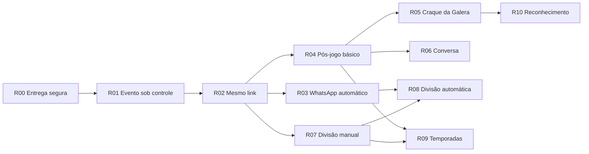

# DeuTime — Roadmap executivo

> Atualizado em 27 de julho de 2026.

Este é o índice curto de direção e sequência. O detalhamento funcional está no [Catálogo de capacidades](backlog.md), as regras estáveis no [Contexto canônico](product-context.md) e a execução no [Playbook](development.md).

## Passado — base comprovada

O produto já possui:

- SaaS multi-time com RLS, PII separada, CI, pgTAP e infraestrutura como código;
- identidade global para atletas reivindicados e vínculo independente por time;
- onboarding, convites, BID, agenda avulsa/recorrente e confirmação autenticada;
- súmula administrativa com placar, lances, encerramento e correções auditadas;
- página pública do time, perfil público consentido e mídia privada;
- OTP no WhatsApp e outbox como fundação, ainda sem automação operacional.

O padrão técnico comprovado é uma fatia vertical: UI mobile → Server Action fina → RPC transacional → autorização/RLS → testes e auditoria. Os fatos exatos possuem IDs `BASE-*` no contexto canônico.

## Presente — preparar e entregar o ciclo confiável

| Release | Estado | Resultado | Pacote |
|---|---|---|---|
| **R00 — Fundação de entrega** | `discovery` | Ativação controlada, deploy compatível, staging e smoke test; é uma release habilitadora. | [Abrir](releases/R00-fundacao-de-entrega.md) |
| **R01 — Evento sob controle** | `draft` | Fuso correto e cancelamento/remarcação com histórico preservado. | [Abrir](releases/R01-evento-sob-controle.md) |
| **R02 — Confirmação pelo link** | `draft` | Mesmo link, acesso persistente, SIM/NÃO/TALVEZ e compartilhamento manual pelo WhatsApp. | [Abrir](releases/R02-confirmacao-pelo-link.md) |

Ordem recomendada para uma única frente: **R00 → R01 → R02**. Pacotes de descoberta podem fechar decisões da release consumidora, mas implementação não começa com decisão que altere schema, autorização ou contrato público ainda aberta.

A R02 só passa a `ready` depois de `DEC-EVENT-PUBLIC-MINIMUM` e `DEC-UNCLAIMED-IDENTITY`; o threat model de `DEC-PERSISTENT-ACCESS` é produzido na R00.

## Futuro — releases verticais

| Release | Resultado autossuficiente | Depende de | Decisão antes de promover | Fallback |
|---|---|---|---|---|
| **R03 — WhatsApp ponta a ponta** | Uma chamada real, consentida e observável, com worker, retry e webhook. | R01, R02 | `DEC-WHATSAPP-PROVIDER` | Compartilhamento manual |
| **R04 — Partida e pós-jogo básico** | Partida mínima, encerramento, presença real e súmula pública/identificada. | R02 | `DEC-EVENT-MATCH`, `DEC-PUBLIC-PRIVACY` | Súmula administrativa |
| **R05 — Craque da Galera** | Voto único anônimo, candidatos presentes e resultado agregado. | R04 | `DEC-ANONYMOUS-RETENTION` | Súmula sem votação |
| **R06 — Conversa da súmula** | Comentários identificados, respostas, denúncia e moderação. | R02, R04 | `DEC-CONVERSATION-LIFETIME`, `DEC-ANONYMOUS-RETENTION` | Súmula somente leitura |
| **R07 — Times manuais compartilháveis** | Divisão acessível, publicação e imagem pelo mesmo link. | R02 | `DEC-EVENT-MATCH` | Lista de confirmados |
| **R08 — Divisão automática** | Sugestão reproduzível, ajustável e explicável. | R03, R07 | `DEC-BALANCE-OBJECTIVE` | Divisão manual |
| **R09 — Camisas, temporadas e tabela** | Camisas, resultados transacionais, tabela e histórico. | R04, R07 | — | Histórico por partida |
| **R10 — Reconhecimento** | Pontos positivos, Craques e perfis consentidos. | R04, R05 | — | Estatísticas básicas |

Depois da R02, R03, R04 e R07 são trilhas independentes. R05 e R06 não esperam divisão automática nem tabela.

Revogação administrativa, “Minha conta”, e-mails e diretório público serão promovidos do catálogo como releases independentes; não bloqueiam artificialmente o ciclo principal.

## Horizonte exploratório — marketplace do futebol amador

Depois que o ciclo principal estiver validado e houver densidade de times, atletas e partidas, o DeuTime poderá evoluir de ferramenta de organização para um marketplace completo do ecossistema do futebol amador:

- encontrar e contratar árbitros;
- encontrar organizadores para jogos, torneios e eventos;
- encontrar e reservar quadras e campos;
- encontrar empresas de churrasco, alimentação e serviços para o pós-jogo;
- descobrir outros atletas e convidá-los para times ou eventos, sempre com controles de privacidade e consentimento;
- cobrar, dividir e repassar os pagamentos do racha;
- gerar receita transacional sobre reservas, contratações e pagamentos processados pela plataforma.

Este horizonte serve apenas para orientar decisões de longo prazo. Ele não recebe número de release, pacote de trabalho, prazo ou implementação agora. Antes de ser promovido, precisa validar demanda e oferta local, confiança entre as partes, reputação, moderação, suporte e as obrigações de pagamento, antifraude, identidade, tributação e LGPD.

## Caminhos críticos

## Regras de promoção

- somente releases ativas ou imediatamente seguintes recebem pacote detalhado;
- uma branch mantém uma única release vertical ativa;
- cada pacote precisa passar pela Definition of Ready do playbook;
- descoberta pode resolver uma decisão aberta; implementação dependente não pode começar antes dela;
- release nova nasce desligada, possui piloto, telemetria, fallback e rollback;
- expansão de banco é verificada antes do consumidor ou aplicação e banco toleram as duas ordens de deploy;
- segurança, privacidade, mobile, WhatsApp, documentação e operação são gates de cada release;
- ao concluir, evidências atualizam o pacote, os fatos `BASE-*` e este índice.
